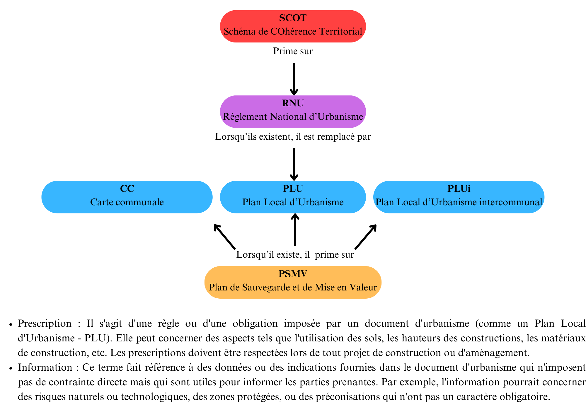
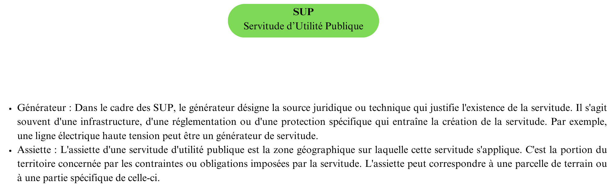

---
title: "Rapport du projet enjeux patrimoniaux"
output:
  html_document:
    toc: true          # Active le sommaire
    toc_float: true    # Rendre le sommaire flottant et interactif
    toc_depth: 2       # Définir le niveau de profondeur (par défaut, 2)
date: '2024-09-13'
author: Ninon Delattre, Adèle Desaint, Sylvain Giraudo, Cyril Guillaumant, Louise Rovel
---

# I. Introduction

## 1. Présentation globale du projet

La gestion d'un massif forestier et l'écriture de documents d'aménagement nécessitent de s'intéresser aux enjeux environnants dont les enjeux patrimoniaux. Ces informations (telles que les monuments historiques, les sites inscrits et classés, les aligements d'arbres etc...) se trouvent dans des documents d'urbanisme (PLU, PLUi, CC, PSMV) ainsi que dans des SUP (Servitudes d'Utilité Publique) et des SCOT (Schémas de Cohérence Territoriale). Elles sont regroupées sur le géoportail de l'urbanisme.

## 2. Justification du besoin des données relatives aux enjeux patrimoniaux

Il est nécessaire de s'intéresser aux enjeux patrimoniaux d'un massif forestier car il en découle des contraintes voire des interdictions. Chaque prescription ou information de document d'urbanisme et chaque SUP est liée à un article de loi ou à un réglement des codes forestier, de l'urbanisme, du patrimoine ou de l'environnement, qui en stipule les conséquences. Par exemple, une prescription ayant trait au patrimoine bâti ou paysager à protéger est liée à l'article L151-19 du code de l'urbanisme, qui stipule qu'il est obligatoire d'assurer leur préservation, leur conservation ou leur restauration.

## 3. Description des documents d'aménagements (et SUP)

Le géoportail de l'urbanisme (GPU) permet d'acceder aux informations de différents documents d'urbanisme :

-   PLU (Plan Local d’Urbanisme) :\
    Le PLU est un document d'urbanisme à l'échelle communale qui définit les règles de construction et d'aménagement pour l'ensemble du territoire de la commune. Il détermine notamment l'affectation des sols, les zones constructibles, les hauteurs maximales des constructions, etc.

-   CC (Carte Communale) :\
    La Carte Communale est un document d'urbanisme simplifié qui délimite les zones constructibles et non constructibles sur le territoire d'une commune. Elle est utilisée principalement dans les petites communes qui ne disposent pas d'un PLU.

-   PSMV (Plan de Sauvegarde et de Mise en Valeur) :\
    Le PSMV est un document d'urbanisme spécifique aux secteurs sauvegardés, généralement des centres historiques, où il fixe des règles précises de préservation et de mise en valeur du patrimoine bâti. Il régit les travaux de construction, de rénovation, ou de démolition dans ces secteurs.

-   PLUi (Plan Local d’Urbanisme intercommunal) :\
    Le PLUi est un PLU qui s'applique non pas à une seule commune, mais à un ensemble de communes (intercommunalité). Il permet une planification cohérente et concertée à l'échelle de plusieurs communes.

-   SCOT (Schéma de Cohérence Territoriale) :\
    Le SCOT est un document de planification stratégique qui fixe les grandes orientations de l’aménagement du territoire à l'échelle de plusieurs communes ou d'une intercommunalité. Il couvre des domaines comme l'urbanisme, le logement, les transports, et l'environnement.

-   RNU (Règlement National d’Urbanisme) :\
    Le RNU est un ensemble de règles d'urbanisme qui s'appliquent dans les communes qui ne disposent pas de documents d'urbanisme locaux (comme un PLU). Ces règles définissent les conditions de construction et d'aménagement du territoire au niveau national.

-   SUP (Servitudes d’Utilité Publique) :\
    Les SUP sont des contraintes administratives imposées à certaines propriétés privées dans l'intérêt général. Elles sont liées à la présence d’infrastructures, de protections environnementales, ou de risques naturels, et limitent les droits d'usage et de construction sur les terrains concernés.

Ces différents documents jouent un rôle clé dans l'aménagement du territoire en France, en encadrant les projets d'urbanisme et en garantissant une cohérence entre les différents niveaux de planification (Legifrance, 2024). Cependant, ils ne sont pas équivalents. Certains servent de substitution en l'absence de certains documents et d'autres prévalent sur le reste (Legifrance, 2020).


<center><u>Documents d'urbanisme</u></center>



<center><u>Servitude d'Utilité Publique</u></center>

## 4. Problématique

La nécessité de s'intéresser aux enjeux patrimoniaux pousse à automatiser l'importation des données regroupées sur le géoportail de l'urbanisme. Pour cela, il faudra d'abord identifier les documents d'urbanisme, SCOT ou SUP existant sur notre zone d'étude, puis récupérer les données utiles dans ces documents. 


# II. Matériel et Méthode

## 1. Utilisation du géoportail de l'urbanisme : identification des documents d'urbanisme et tri des données utilisées

Afin de récupérer les données sur le géoportail de l'urbanisme, il est nécessaire
de comprendre ce qui identifie les documents, mais aussi comment les données y 
sont organisées. Cela permet de trier ces données en fonction de leur utilité dans l'écriture d'un document d'aménagement dont les informations relatives aux enjeux partimoniaux. 

Les documents d'urbanisme, les SCOT et les SUP sont identifiés par deux éléments :  
une partition et une localisation. 
La manière dont sont construites ces partitions, ainsi que la composition standard de chaque document, est disponible ici pour les documents d'urbanisme :   
https://cnig.gouv.fr/ressources-dematerialisation-documents-d-urbanisme-a2732.html.   
et ici pour les SUP :   
https://www.geoinformations.developpement-durable.gouv.fr/fichier/pdf/tableau_alpha-numerique_des_supet_base_legale_maj_20_06_24_2_cle7dbc5e.pdf?arg=177836385&cle=0ef0d333b5d4e35418b5f3b71d2d3849a002c26f&file=pdf%2Ftableau_alpha-numerique_des_supet_base_legale_maj_20_06_24_2_cle7dbc5e.pdf. 

Les partitions des documents d'urbanisme sont faciles à trouver
car elles ne prennent en compte que le type de document et le code INSEE des
communes, à l'exception des PLUi et des SUP. Les partitions des PLUi 
comprennent les codes des communautés de commune, tandis que les SUP, qui ne 
sont pas, par définition, des documents d'urbanisme, ont une partition 
complètement différente. 

Ainsi, afin de savoir s'il existe des documents d'urbanisme en un 
endroit donné, on récupère les codes INSEE des communes correspondantes. Ces codes INSEE
sont nécessaires pour savoir si la commune est soumise à un RNU. Si elle ne l'est
pas, c'est qu'il existe d'autres documents d'urbanisme. Le package happign permet de les récupérer.

Après avoir listé les documents d'urbanismes présents sur la zone d'étude, il est possible d'importer toutes les données utiles à partir de la localisation de la zone d'étude. L'importation des SUP et la décourverte de leur existance se déroule aussi à ce moments là.. 

Ensuite, les standards de ces documents servent à trier 
les données utiles aux forestiers, pour identifier les enjeux patrimoniaux par 
exemple, mais nous verrons par la suite que d'autres données intéressantes sont 
aussi disponibles. On prend donc une à une chacune des prescriptions et 
informations des documents d'urbanisme, et chacun des types de SUP, pour
identifier si elles correspondent à des enjeux patrimoniaux. Pour cela, il est
souvent nécessaire de se référer aux articles de loi ou réglements qu'elles
appliquent. 

## 2. Packages R : happign, tmap, sf, dplyr 

Un certain nombre de packages ont été utilisés pour réaliser notre projet :  
**happign**, un package permettant de faciliter l’accès au service web et API de 
l’IGN. Ce package nous a permis de récupérer un grand nombre de données du 
géoportail de l’urbanisme (GPU) et de les intersecter facilement avec une 
zone d'étude, en particulier grâce à la fonction get_apicarto_gpu().  
**tmap**, un package permettant d’éditer des données spatiales nous a, quant à 
lui, permis de visualiser nos résultats ainsi que de récupérer des emprises pour 
tester nos fonctions.  
**sf**, un package permettant de manipuler, importer et exporter des 
données spatiales.  
**dplyr**, un package permettant de manipuler facilement des tableaux de données 
dans R.  

## 3. Autre méthode : flux WFS du géoportail de l'urbanisme

En dehors du package happign, il est également possible de récupérer directement
les flux WFS mis à disposition par le géoportail de l'urbanisme.    
Cette méthode a été explorée pour les SUP pour deux raisons.
La première raison est la complexité des partitions des SUP. En effet, 
contrairement aux partitions des documents d'urbanisme qui sont une combinaison 
de l'abrévation du document et du code INSEE des communes (par exemple, les 
partitions des PLU sont sous la forme DU_INSEE), les partitions des SUP 
prennent en compte la date de décision de la SUP et le type de SUP, deux 
informations qu'on ne peut obtenir sans connaitre la SUP au préalable. 
La deuxième raison est que, il est impossible de récupérer les partitions des 
SUP grâce à la fonction happign::get_apicarto_gpu, comme c'est le cas pour les PLUi par exemple.
La méthode utilisant directement les flux WFS s'appliquerait uniquement dans le 
cas où l'on ne souhaite travailler qu'avec des codes INSEE et non avec un vecteur
de surface correspondant à notre zone d'étude.  
Pour mettre en place cette méthode, il est nécessaire de se procurer le lien du 
service de téléchargement de flux WFS du géoportail de l'urbanisme :
https://data.geopf.fr/wfs/ows?SERVICE=WFS&VERSION=2.0.0&REQUEST=GetCapabilities. 
Ensuite, il faut récupérer les couches relatives aux SUP : celles des générateurs 
et celles de leurs assiettes, chacune déclinée en vecteurs surfaciques, linéaires
et ponctuels. Puis il faut manipuler les tableaux de données afin de faire 
l'intersection avec notre zone d'étude et trier les informations ayant trait aux
enjeux patrimoniaux.


## 4. Méthode de réalisation de la fonction : plusieurs fonctions puis aggrégation

L'objectif de la fonction finale est de partir d'une zone d'étude et d'extraire les données associées aux enjeux patrimoniaux trouvées dans les documents d'urbanisme et les SUP. Cette fonction doit avoir plusieures propriétés. Elle doit permettre d'importer et de filtrer seulement les informations utiles à l'utilisateur. Elle doit pouvoir afficher ces informations sur une carte mais aussi les exporter sous forme de geopackage (.gpkg). C'est pourquoi la fonction se divise en plusieures étapes :

-   Tout d'abord, la zone d'étude, entrée sous format sf ou sfc, doit être tranformée dans un système de projection Lambert 93 et légèrement élargie grâce à un buffer. Ces deux étapes facilitent ensuite l'affichage et la lisibilité sur des cartes françaises. Le buffer permet également de récupérer des données sur une zone plus large.

-   Les données du géoportail de l'urbanisme se superposant à la zone d'étude peuvent ensuite être importées en quatre catégories : les prescriptions et les informations issues des documents d'urbanisme (PLU, PLUi, PSMV, CC), et les générateurs et les assiettes des SUP. Pour chacune de ces quatres catégories, un filtre est réalisé pour ne garder que les données liés aux enjeux patrimoniaux.

-   Ces quatres dataframe doivent ensuite être fusionnés dans une liste qui, après transformation du système de projection en Lambert 93, deviendra le resultat en sortie de la fonction.

Afin de rajouter des propriétés utiles à la fonction finale, un choix est laissé à l'utilisateur :

-   De réaliser un second filtre à la main après l'importation des données afin de diminuer la quantité d'informations extraites et de simplifier l'analyse des données.

-   D'afficher une carte brute des informations extraites avec le package tmap et de pouvoir explorer facilement les données.

-   D'exporter les données sous un format geopackage utilisable avec des logiciels SIG.

Cette fonction doit donc faire appel à de nombreuses petites fonctions permettant de réaliser tour à tour les tâches souhaitées.
 
# III. Résultats

## 1. Liste finale des données utiles dans les documents d'aménagement

```{r, echo = FALSE, results = 'hide',message=FALSE, warning=FALSE  }
library(librarian)
# Installation et chargement des packages
librarian::shelf(happign,dplyr,sf,tidyverse,tmap)
# Parametrage de tmap
tmap_mode("view"); tmap_options(check.and.fix = TRUE)


code_prescription_patrimonial <- c("01", "07", "18", "31", "34", "35", "43",
                                   "46", "99")
libelle_prescription_patrimonial <- c(
  "Espace boisé classé",
  "Patrimoine bâti, paysager ou éléments de paysages à protéger",
  "Périmètre comportant des orientations d’aménagement et deprogrammation (OAP)",
  "Espaces remarquables du littoral",
  "Espaces, paysage et milieux caractéristiques du patrimoine naturel et culturel montagnard à préserver",
  "Terres nécessaires au maintien et au développement des activités agricoles, pastorales et forestières à préserver",
  "Réalisation d’espaces libres, plantations, aires de jeux et de loisir",
  "Constructibilité espace boisé antérieur au 20ème siècle",
  "Autre")

prescription_patrimonial <- data.frame(code_prescription_patrimonial,libelle_prescription_patrimonial)

code_info_patrimonial <- c("16", "25", "40", "99")
libelle_info_patrimonial <- c(
  "Site archéologique",
  "Périmètre de protection des espaces agricoles et naturels périurbain",
  "Périmètre d’un bien inscrit au patrimoine mondial ou Zone tampon d’un bien inscrit au patrimoine mondial",
  "Autre"
  )

info_patrimonial <- data.frame(code_info_patrimonial,libelle_info_patrimonial)

code_sup_patrimonial <- c("a10","ac1","ac4","ac2")

libelle_sup_patrimonial <- c(
  "Zones de protection naturelle, agricole et forestière du plateau de Saclay",
   "Servitudes relatives aux monuments historiques",
   "Sites patrimoniaux remarquables, zones de protection et de valorisation du patrimoine architectural, urbain et paysager",
   "Servitudes relatives aux sites inscrits et classés")


sup_patrimonial <- data.frame(code_sup_patrimonial,libelle_sup_patrimonial)


```
En utilisant les standards utilisés pour les documents d'urbanisme ainsi que les articles de loi qui s'y rattachent, nous avons pu mettre en place la liste des enjeux patrimoniaux suivante :

```{r, echo = FALSE}
knitr::kable(prescription_patrimonial, caption = "liste des prescriptions retenues ayant trait aux enjeux patrimoniaux")
knitr::kable(info_patrimonial, caption = "liste des informations retenues ayant trait aux enjeux patrimoniaux")
knitr::kable(sup_patrimonial, caption = "liste des SUP retenues ayant trait aux enjeux patrimoniaux")
```
Il ne semble y avoir aucune donnée pertinente dans les SCOT. 

## 2. Identification des documents d'urbanisme existant dans une zone

À partir d'une géométrie de base, il est possible de trouver les partitions des documents d'urbanisme en passant par les codes INSEE de toutes les communes présentes dans la zone.

La fonction *get.code.insee* permet d'obtenir les codes INSEE des communes localisées sur la zone d'étude. La fonction *insee.to.document* permet d'afficher les communes possédant des RNU ou non ainsi que les documents d'urbanisme (PLU, PLUi, PSMV et CC) associés à ces communes.

```{r, echo=FALSE, Eval=TRUE}
# fonction pour obtenir les codes insee des communes associees a une geometrie ----
get.code.insee <- function(shp){
  if (inherits(shp, c("sf", "sfc"))) {
    communes <- get_apicarto_gpu(shp,"municipality")
    code_insee <- communes$insee
  } else {
    stop("x must be of class sf or sfc.")
  }
  return(code_insee)
}

# Fonction pour décrire quels sont les documents d'urbanisme present dans les communes ----
insee.to.documents <- function(code_insee){
  
  if(!inherits(code_insee,"character")){
    stop("x must be of class character")
  }
  
  # Y a-t-il un rnu associé à ces codes insee ?
  is_rnu <- get_apicarto_gpu(code_insee, ressource = "municipality")
  
  # Séparation des municipalités avec et sans rnu
  is_rnu_TRUE <- filter(is_rnu, is_rnu == TRUE)
  is_rnu_FALSE <- filter(is_rnu, is_rnu == FALSE)
  
  # Affichage des communes présentes avec ou sans rnu
  cat("\nCommunes with rnu are:\n")
  print(is_rnu_TRUE$name)
  
  cat("\nCommunes without rnu are:\n")
  print(is_rnu_FALSE$name)
  
  # Creation de dataframe conenant les documents d'urbanismes 
  doc_urbanisme <- data.frame(grid_title = character(),
                              partition = character(),
                              du_type = character(),
                              stringsAsFactors = FALSE)
  
  # Parcours de des comunnes non soumises au rnu
  for (i in 1:nrow(is_rnu_FALSE)) {
    
    row <- is_rnu_FALSE[i,]
    doc <- get_apicarto_gpu(row, "document", dTolerance = 10)  # chargement des documents de la commune
    
    if (is.null(doc)) {
      next
    }
    
    doc_filtered <- doc |> 
      filter(grid_title == row$name) # extraction des documents spécifiques à la commune (PLU, PSMV, CC)
    
    # Si aucuns documents associes a la commune, 
    # extraction du PLUi s'il existe
    if (nrow(doc_filtered) == 0) {
      doc_filtered <- doc |>
        filter(du_type == "PLUi")
    }
    
    # Si toujours pas de résultats, afficher un avertissement
    if (nrow(doc_filtered) == 0) {
      warning(paste("No document found for", row$name))
      next
    }
    
    # Ajout des documents filtrees au dataframe
    doc_urbanisme <- rbind(doc_urbanisme, 
                           doc_filtered)
  }
  
  # suppression des dupplicats (par exemple si plusieurs fois le meme PLUi)
  doc_urbanisme_unique <- doc_urbanisme[!duplicated(doc_urbanisme), ]
  
  # Affichage des partitions de documents d'urbanisme associes aux communes.
  cat("\nThe following town planning documents exist in the surrounding municipalities:\n")
  print (as.data.frame(doc_urbanisme_unique)[,c("grid_title", "partition", "du_type")])
  
  return(doc_urbanisme_unique)
}

```

```{r, echo=TRUE, EVAL=TRUE, include=TRUE}
resultats <- insee.to.documents(c("05023","05183","05109"))

```
Ici, seuls Briançon et Villar-Saint-Pancrace possèdent des PLU tandis que Puy-Saint-Pierre est soumis à un RNU.


## 3. Les différentes fonctions d'importation utilisées selon la source de données

Une fonction d'importation est réalisée par source de données : prescriptions et
informations provenant des documents d'urbanisme, générateurs et assiettes des 
SUP, soit quatre fonctions au total. 

Ci-dessous l'exemple de la fonction permettant d'importer les prescriptions : 

```{r, echo = F}
code_prescription_general <- c("01", "07", "18", "19", "25", "31", "34", "35",
                               "43", "46", "99")
libelle_prescription_general <- c(
  "Espace boisé classé",
  "Patrimoine bâti, paysager ou éléments de paysages à protéger",
  "Périmètre comportant des orientations d’aménagement et deprogrammation 
  (OAP)",
  "Secteur protégé en raison de la richesse du sol et du sous-sol",
  "Eléments de continuité écologique et trame verte et bleue",
  "Espaces remarquables du littoral",
  "Espaces, paysage et milieux caractéristiques du patrimoine naturel et 
  culturel montagnard à préserver",
  "Terres nécessaires au maintien et au développement des activités agricoles, 
  pastorales et forestières à préserver",
  "Réalisation d’espaces libres, plantations, aires de jeux et de loisir",
  "Constructibilité espace boisé antérieur au 20ème siècle",
  "Autre")

# Codes et libelles des prescriptions relatives aux enjeux patrimoniaux
code_prescription_patrimonial <- c("01", "07", "18", "31", "34", "35", "43",
                                   "46", "99")
libelle_prescription_patrimonial <- c(
  "Espace boisé classé",
  "Patrimoine bâti, paysager ou éléments de paysages à protéger",
  "Périmètre comportant des orientations d’aménagement et deprogrammation 
  (OAP)",
  "Espaces remarquables du littoral",
  "Espaces, paysage et milieux caractéristiques du patrimoine naturel et 
  culturel montagnard à préserver",
  "Terres nécessaires au maintien et au développement des activités agricoles, 
  pastorales et forestières à préserver",
  "Réalisation d’espaces libres, plantations, aires de jeux et de loisir",
  "Constructibilité espace boisé antérieur au 20ème siècle",
  "Autre")

# Codes et libelles des prescriptions relatives aux enjeux ecologiques
code_prescription_ecologique <- c("01","18", "25", "34", "43", "99")
libelle_prescription_ecologique <- c(
  "Espace boisé classé",
  "Périmètre comportant des orientations d’aménagement et deprogrammation 
  (OAP)",
  "Eléments de continuité écologique et trame verte et bleue",
  "Espaces, paysage et milieux caractéristiques du patrimoine naturel et 
  culturel montagnard à préserver",
  "Réalisation d’espaces libres, plantations, aires de jeux et de loisir",
  "Autre")

# Codes et libelles des informations relatives a la gestion forestiere 
code_info_general <- c("03", "08", "16", "21", "22","25", "37", "40", "99")
libelle_info_general <- c(
  "Zone de préemption dans un espace naturel et sensible",
  "Périmètre forestier : interdiction ou réglementation des plantations (code 
  rural et de la pêche maritime), plantations à réaliser et semis d'essence 
  forestière",
  "Site archéologique",
  "Projet de plan de prévention des risques",
  "Protection des rives des plans d'eau en zone de montagne",
  "Périmètre de protection des espaces agricoles et naturels périurbain",
  "Bois ou forêts relevant du régime forestier",
  "Périmètre d’un bien inscrit au patrimoine mondial ou Zone tampon d’un bien 
  inscrit au patrimoine mondial",
  "Autre")

# Codes et libelles des informations relatives aux enjeux patrimoniaux
code_info_patrimonial <- c("16", "25", "40", "99")
libelle_info_patrimonial <- c(
  "Site archéologique",
  "Périmètre de protection des espaces agricoles et naturels périurbain",
  "Périmètre d’un bien inscrit au patrimoine mondial ou Zone tampon d’un bien 
  inscrit au patrimoine mondial",
  "Autre")

# Codes et libelles des informations relatives aux enjeux ecologiques 
code_info_ecologique <- c("03", "22", "99")
libelle_info_ecologique <- c(
  "Zone de préemption dans un espace naturel et sensible",
  "Protection des rives des plans d'eau en zone de montagne",
  "Autre")
                  
# Codes et libelles des SUP relatives a la gestion forestiere 
code_sup_general <- c("a1","a7","a8","el9","a4","as1","ac3","el10","a10",
                "ac1","ac4","ac2","pm1","el2","pm2","pm4","pm5",
                "pm6","pm7","pm8","pm9")
libelle_sup_general <- c(
  "Serviture de protection des bois et forêts relevant du régime forestier à 
  Mayotte",
  "Servitude relative aux forêts dites de protection",
  "Servitures résultant de la mise en défens des terrains et pâturages en 
  montagnes et dunes du Pas-de-Calais",
  "Servitudes de passage sur le littoral",
  "Servitudes de passage dans le lit ou sur les berges d'un cours d'eau",
  "Servitudes résultant de l'instauration de périmètres de protection autour 
  des captaux d'eaux et des sources minérales naturelles",
  "Réserves naturelles et périmètres de protection autour des réserves 
  naturelles",
  "Coeur de parc national",
  "Zones de protection naturelle, agricole et forestière du plateau de Saclay",
  "Servitudes relatives aux monuments historiques",
  "Sites patrimoniaux remarquables, zones de protection et de valorisation du 
  patrimoine architectural, urbain et paysager",
  "Servitudes relatives aux sites inscrits et classés",
  "Plans de prévention des risques naturels prévisibles (PPRNP) et plans de 
  prévention de risques miniers (PPRM) et documents valant PPRNP",
  "Servitude qui concerne la Loire et ses affluents",
  "Servitudes d'inondation pour la rétention des crues du Rhin",
  "Servitudes autour des installations classées pour la protection de 
  l’environnement et sur des sites pollués, de stockage de déchets ou 
  d’anciennes carrières",
  "Servitude relative aux zones de rétention d’eau et aux zones dites 
  'stratégiques pour la gestion de l’eau'",
  "Servitudes visant à ne pas aggraver les risques pour la sécurité publique en 
  présence d’un ouvrages hydraulique",
  "Servitudes autour des installations nucléaires de base",
  "Servitudes relatives aux ouvrages ou infrastructures permettant de prévenir 
  les inondations ou les submersions",
  "Servitudes relatives à la création, la continuité,la pérennité et 
  l’entretien des équipements de défense des forêts contre les incendies 
  (DFCI)",
  "Servitudes relatives aux zones de danger")

# Codes et libelles des SUP relatives aux enjeux patrimoniaux 
code_sup_patrimonial <- c("a10","ac1","ac4","ac2")

libelle_sup_patrimonial <- c(
   "Zones de protection naturelle, agricole et forestière du plateau de Saclay",
   "Servitudes relatives aux monuments historiques",
   "Sites patrimoniaux remarquables, zones de protection et de valorisation du 
   patrimoine architectural, urbain et paysager",
   "Servitudes relatives aux sites inscrits et classés")

# Codes et libelles des SUP relatives aux enjeux ecologiques 
code_sup_ecologique <- c("a8","a4","as1","ac3","el10","a10")
libelle_sup_ecologique <- c(
   "Servitures résultant de la mise en défens des terrains et pâturages en 
   montagnes et dunes du Pas-de-Calais",
   "Servitudes de passage dans le lit ou sur les berges d'un cours d'eau",
   "Servitudes résultant de l'instauration de périmètres de protection autour 
   des captaux d'eaux et des sources minérales naturelles",
   "Réserves naturelles et périmètres de protection autour des réserves 
   naturelles",
   "Coeur de parc national",
   "Zones de protection naturelle, agricole et forestière du plateau de Saclay")

# Selection des colonnes utiles dans les tableaux des generateurs et assiettes 
# de SUP
col_utiles_gen <- c("gid","suptype","partition","fichier","nomgen","typegen",
                   "nomsuplitt","geometry")
col_utiles_ass <- c("gid","suptype","partition","fichier","nomass","typeass",
                   "nomsuplitt","geometry")

# Uniformisation des noms de colonnes des tableaux des generateurs et assiettes 
# de SUP
noms_def <- c("gid","suptype","partition","fichier","nom","libelle",
              "nomsuplitt","geometry")

# Rassemblement de toutes les listes dans un seul repertoire
dico <- list(code_prescription_general = code_prescription_general,
             libelle_prescription_general = libelle_prescription_general,
             code_prescription_patrimonial = code_prescription_patrimonial,
             libelle_prescription_patrimonial = 
               libelle_prescription_patrimonial,
             code_prescription_ecologique = code_prescription_ecologique,
             libelle_prescription_ecologique = libelle_prescription_ecologique,
             code_info_general = code_info_general,
             libelle_info_general = libelle_info_general,
             code_info_patrimonial = code_info_patrimonial,
             libelle_info_patrimonial = libelle_info_patrimonial,
             code_info_ecologique = code_info_ecologique,
             libelle_info_ecologique = libelle_info_ecologique,
             code_sup_general = code_sup_general,
             libelle_sup_general = libelle_sup_general,
             code_sup_patrimonial = code_sup_patrimonial,
             libelle_sup_patrimonial = libelle_sup_patrimonial,
             code_sup_ecologique = code_sup_ecologique,
             libelle_sup_ecologique = libelle_sup_ecologique,
             col_utiles_ass =  col_utiles_ass,
             col_utiles_gen = col_utiles_gen,
             noms_def = noms_def)

```

```{r , eval=T, include=T}

villar <- get_apicarto_gpu("05183", ressource = "municipality")

# Recuperation des prescriptions sur le GPU
get.gpu.prescription <- function(x, dico){
  
  # Recuperation des surfaces, lignes et points
  prescription_surf <- get_apicarto_gpu(x,
                                        ressource = c("prescription-surf"))
  prescription_lin <- get_apicarto_gpu(x,
                                       ressource = c("prescription-lin"))
  prescription_pct <- get_apicarto_gpu(x,
                                       ressource = c("prescription-pct"))
  prescription_pct <- prescription_pct[ ,
                                        !(names(prescription_pct) %in% "angle")]

  # Creation d'un seul tableau avec les donnees surfaciques, lineaires et 
  # ponctuelles
  prescription <- rbind(prescription_surf, prescription_lin, prescription_pct)

  # Tri des prescriptions grace aux listes definies en debut de code 
  if (!is.null(prescription)){
    prescription <- 
      filter(prescription, typepsc %in% dico[["code_prescription_patrimonial"]])
    
  }
  return(prescription)
}

resultat <- get.gpu.prescription(villar, dico)
```

```{r, echo = F}

knitr::kable(head(resultat[,"libelle"]), caption = "Prescriptions retenues à Villar Saint Pancrace")

```

## 4. Les dyfonctionnements de la récupération par flux WFS

En utilisant les flux WFS du géoportail de l'urbanisme, une fonction 
permettant de récupérer les SUP d'une zone d'étude est écrite : 

```{r, eval=T, include=T}
knitr::opts_chunk$set(echo = T)

get.sup <- function(x){

  # Recuperation des SUP
  wfs_url <- "https://data.geopf.fr/wfs/ows?SERVICE=WFS&VERSION=1.1.0&REQUEST=GetCapabilities"
  SUP_s <- st_read(wfs_url, layer = "wfs_sup:assiette_sup_s") 
  SUP_s <- st_transform(SUP_s, 2154)
  
  # Selection des SUP utiles 
  SUP_s <- SUP_s[
    SUP_s$suptype == "ac1"|   # monuments historiques
    SUP_s$suptype == "ac4"|   # patrimoine architectural
    SUP_s$suptype == "ac2",]   # sites inscrits et classes
  
  # Separation des geometries valides et invalides
  valid_SUP_s <- SUP_s[st_is_valid(SUP_s$the_geom) == T, ]
  invalid_SUP_s <- SUP_s[!st_is_valid(SUP_s$the_geom) == T,]

  # Recherche des SUP dans la commune consideree
  point <- get_apicarto_cadastre(x, type = "commune")
  point <- st_transform(point, 2154)

  SUP_s_point <- valid_SUP_s[st_intersection(valid_SUP_s$the_geom,point),]
  
  # Si la geometrie est invalide, on cherche le code INSEE dans les SUP
  SUP_commune <- grep(x, invalid_SUP_s$partition) 
  
  departement <- substring(x,1,2)
  SUP_departement <- grep("_'departement'_", invalid_SUP_s$partition)

  return(list(SUP_s_point, SUP_commune, SUP_departement))
  
}

resultat <- get.sup("80021") # Amiens
qtm(resultat[[1]])
```

La fonction renvoie des résultats concluants, mais incomplets, du fait de deux problèmes.   
Le premier est que la fonction recherche des intersections afin de savoir s'il 
y a des SUP dans la zone d'étude, ce qui présuppose que les géometries soient 
valides. Or les géometries des assiettes des SUP ne le sont pas toutes. Il 
faut donc séparer les SUP à géometries valides et invalides. Pour les géometries 
invalides, au lieu de rechercher une intersection, la fonction recherche le code 
INSEE de la commune dans les partitions des SUP, voire le code département. 
Cette recherche est donc laborieuse puisque si la fonction renvoie toutes les 
SUP du département. Il faut ensuite les afficher toutes et chercher visuellement 
celles dans la zone d'étude.    

Le deuxième problème rend cette méthode invalide. En effet, les requêtes sur les
flux WFS sont paginées et limitées à 5000 éléments : la fonction ne renvoie donc
que les 5000 premières SUP de la liste.    

La méthode utilisant le service de téléchargement de flux WFS du géoportail de 
l'urbanisme ne sera donc pas utilisée.

## 5.Choix de l'utilisateur

Un filtre a déja été effectué selon les enjeux patrimoniaux, cependant tout ces enjeux ne sont pas forcément souhaités par l'utilisateur. Une fonction permet de filtrer à la main le type de données à extraire a été implementée. Elle est composée de trois fonctions : la première permettant de récupérer les différents libellés présents sur l'emprise; la deuxième, faisant office d'interface utilisateur, affichnt les libellés présents dans la zone et récupèrant les choix de l'utilisateur; la troisième permettant d'appliquer ces filtres.  
Un exemple de saisie ci-dessous :  

```{r}
# Dans prescriptions
# les libelles présents sont: 
# 
# 1 Secteur remarquable à préserver. Fermes de la Reconstruction - Hameau de Soubeyran
# 2 Secteur remarquable à préserver. Fermes de la Reconstruction - Hameau Le Paquier
# 3 Périmètre d'application des OAP
# 4 Espace naturel à protéger : Bois des Ayes
# 5 Secteur remarquable à préserver. Fermes de la Reconstruction - Chef-Lieu
# 6 Secteur remarquable à préserver. Bâtis traditionnels formant le tissu ancien du bourg
# 7 Canaux à préserver
# 8 Elément patrimonial à préserver. Cadran solaire
# 9 Elément patrimonial à préserver. Moulin
#
# Veuillez entrer une liste des numéros de ligne des libelles voulus
#       séparés par des virgules 
# (ex : 1,2,3) :
# 8,9
# 
# Vous avez choisi les libelles suivant:
# [1] "Elément patrimonial à préserver. Cadran solaire"
# [2] "Elément patrimonial à préserver. Moulin"        
# 
#  Dans assiettes_sup
# les libelles présents sont: 
# 
# 1 Périmètre des abords
# 2 Monument historique
# 
# Veuillez entrer une liste des numéros de ligne des libelles voulus
#       séparés par des virgules 
# (ex : 1,2,3) :
# 2
# 
# Vous avez choisi les libelles suivant:
# [1] "Monument historique"


```

## 6. Affichage brut des données récupérées

```{r, echo = FALSE, results = 'hide',message=FALSE, warning=FALSE}

# A propos du code -----

# Titre du code : gpuachercher
# But du code : Recuperation des donnees relatives a la gestion forestiere sur 
# le geoportail de l'urbanisme
# Auteurs : Ninon Delattre, Adele Desaint, Sylvain Giraudo, Cyril Guillaumant, 
# Louise Rovel
# Contact : sylvain.giraudo13@gmail.com
# Derniere mise a jour : 12/09/2024

# Installation des packages ----

# Ce code necessite l'installation des packages rstudioapi et librarian

# Installation et chargement des packages
librarian::shelf(happign,dplyr,sf,tidyverse,tmap)
# Parametrage de tmap
tmap_mode("view"); tmap_options(check.and.fix = TRUE)

# Repertoire de travail -----

# Repertoire de travail relatif a la source du fichier 
setwd(dirname(rstudioapi::getActiveDocumentContext()$path))

# Nettoyage de l'environnement R ----
rm(list=ls())

# Importation des données ----

# Codes et libelles des prescriptions relatives a la gestion forestiere 
code_prescription_general <- c("01", "07", "18", "19", "25", "31", "34", "35",
                               "43", "46", "99")
libelle_prescription_general <- c(
  "Espace boisé classé",
  "Patrimoine bâti, paysager ou éléments de paysages à protéger",
  "Périmètre comportant des orientations d’aménagement et deprogrammation 
  (OAP)",
  "Secteur protégé en raison de la richesse du sol et du sous-sol",
  "Eléments de continuité écologique et trame verte et bleue",
  "Espaces remarquables du littoral",
  "Espaces, paysage et milieux caractéristiques du patrimoine naturel et 
  culturel montagnard à préserver",
  "Terres nécessaires au maintien et au développement des activités agricoles, 
  pastorales et forestières à préserver",
  "Réalisation d’espaces libres, plantations, aires de jeux et de loisir",
  "Constructibilité espace boisé antérieur au 20ème siècle",
  "Autre")

# Codes et libelles des prescriptions relatives aux enjeux patrimoniaux
code_prescription_patrimonial <- c("01", "07", "18", "31", "34", "35", "43",
                                   "46", "99")
libelle_prescription_patrimonial <- c(
  "Espace boisé classé",
  "Patrimoine bâti, paysager ou éléments de paysages à protéger",
  "Périmètre comportant des orientations d’aménagement et deprogrammation 
  (OAP)",
  "Espaces remarquables du littoral",
  "Espaces, paysage et milieux caractéristiques du patrimoine naturel et 
  culturel montagnard à préserver",
  "Terres nécessaires au maintien et au développement des activités agricoles, 
  pastorales et forestières à préserver",
  "Réalisation d’espaces libres, plantations, aires de jeux et de loisir",
  "Constructibilité espace boisé antérieur au 20ème siècle",
  "Autre")

# Codes et libelles des prescriptions relatives aux enjeux ecologiques
code_prescription_ecologique <- c("01","18", "25", "34", "43", "99")
libelle_prescription_ecologique <- c(
  "Espace boisé classé",
  "Périmètre comportant des orientations d’aménagement et deprogrammation 
  (OAP)",
  "Eléments de continuité écologique et trame verte et bleue",
  "Espaces, paysage et milieux caractéristiques du patrimoine naturel et 
  culturel montagnard à préserver",
  "Réalisation d’espaces libres, plantations, aires de jeux et de loisir",
  "Autre")

# Codes et libelles des informations relatives a la gestion forestiere 
code_info_general <- c("03", "08", "16", "21", "22","25", "37", "40", "99")
libelle_info_general <- c(
  "Zone de préemption dans un espace naturel et sensible",
  "Périmètre forestier : interdiction ou réglementation des plantations (code 
  rural et de la pêche maritime), plantations à réaliser et semis d'essence 
  forestière",
  "Site archéologique",
  "Projet de plan de prévention des risques",
  "Protection des rives des plans d'eau en zone de montagne",
  "Périmètre de protection des espaces agricoles et naturels périurbain",
  "Bois ou forêts relevant du régime forestier",
  "Périmètre d’un bien inscrit au patrimoine mondial ou Zone tampon d’un bien 
  inscrit au patrimoine mondial",
  "Autre")

# Codes et libelles des informations relatives aux enjeux patrimoniaux
code_info_patrimonial <- c("16", "25", "40", "99")
libelle_info_patrimonial <- c(
  "Site archéologique",
  "Périmètre de protection des espaces agricoles et naturels périurbain",
  "Périmètre d’un bien inscrit au patrimoine mondial ou Zone tampon d’un bien 
  inscrit au patrimoine mondial",
  "Autre")

# Codes et libelles des informations relatives aux enjeux ecologiques 
code_info_ecologique <- c("03", "22", "99")
libelle_info_ecologique <- c(
  "Zone de préemption dans un espace naturel et sensible",
  "Protection des rives des plans d'eau en zone de montagne",
  "Autre")
                  
# Codes et libelles des SUP relatives a la gestion forestiere 
code_sup_general <- c("a1","a7","a8","el9","a4","as1","ac3","el10","a10",
                "ac1","ac4","ac2","pm1","el2","pm2","pm4","pm5",
                "pm6","pm7","pm8","pm9")
libelle_sup_general <- c(
  "Serviture de protection des bois et forêts relevant du régime forestier à 
  Mayotte",
  "Servitude relative aux forêts dites de protection",
  "Servitures résultant de la mise en défens des terrains et pâturages en 
  montagnes et dunes du Pas-de-Calais",
  "Servitudes de passage sur le littoral",
  "Servitudes de passage dans le lit ou sur les berges d'un cours d'eau",
  "Servitudes résultant de l'instauration de périmètres de protection autour 
  des captaux d'eaux et des sources minérales naturelles",
  "Réserves naturelles et périmètres de protection autour des réserves 
  naturelles",
  "Coeur de parc national",
  "Zones de protection naturelle, agricole et forestière du plateau de Saclay",
  "Servitudes relatives aux monuments historiques",
  "Sites patrimoniaux remarquables, zones de protection et de valorisation du 
  patrimoine architectural, urbain et paysager",
  "Servitudes relatives aux sites inscrits et classés",
  "Plans de prévention des risques naturels prévisibles (PPRNP) et plans de 
  prévention de risques miniers (PPRM) et documents valant PPRNP",
  "Servitude qui concerne la Loire et ses affluents",
  "Servitudes d'inondation pour la rétention des crues du Rhin",
  "Servitudes autour des installations classées pour la protection de 
  l’environnement et sur des sites pollués, de stockage de déchets ou 
  d’anciennes carrières",
  "Servitude relative aux zones de rétention d’eau et aux zones dites 
  'stratégiques pour la gestion de l’eau'",
  "Servitudes visant à ne pas aggraver les risques pour la sécurité publique en 
  présence d’un ouvrages hydraulique",
  "Servitudes autour des installations nucléaires de base",
  "Servitudes relatives aux ouvrages ou infrastructures permettant de prévenir 
  les inondations ou les submersions",
  "Servitudes relatives à la création, la continuité,la pérennité et 
  l’entretien des équipements de défense des forêts contre les incendies 
  (DFCI)",
  "Servitudes relatives aux zones de danger")

# Codes et libelles des SUP relatives aux enjeux patrimoniaux 
code_sup_patrimonial <- c("a10","ac1","ac4","ac2")

libelle_sup_patrimonial <- c(
   "Zones de protection naturelle, agricole et forestière du plateau de Saclay",
   "Servitudes relatives aux monuments historiques",
   "Sites patrimoniaux remarquables, zones de protection et de valorisation du 
   patrimoine architectural, urbain et paysager",
   "Servitudes relatives aux sites inscrits et classés")

# Codes et libelles des SUP relatives aux enjeux ecologiques 
code_sup_ecologique <- c("a8","a4","as1","ac3","el10","a10")
libelle_sup_ecologique <- c(
   "Servitures résultant de la mise en défens des terrains et pâturages en 
   montagnes et dunes du Pas-de-Calais",
   "Servitudes de passage dans le lit ou sur les berges d'un cours d'eau",
   "Servitudes résultant de l'instauration de périmètres de protection autour 
   des captaux d'eaux et des sources minérales naturelles",
   "Réserves naturelles et périmètres de protection autour des réserves 
   naturelles",
   "Coeur de parc national",
   "Zones de protection naturelle, agricole et forestière du plateau de Saclay")

# Selection des colonnes utiles dans les tableaux des generateurs et assiettes 
# de SUP
col_utiles_gen <- c("gid","suptype","partition","fichier","nomgen","typegen",
                   "nomsuplitt","geometry")
col_utiles_ass <- c("gid","suptype","partition","fichier","nomass","typeass",
                   "nomsuplitt","geometry")

# Uniformisation des noms de colonnes des tableaux des generateurs et assiettes 
# de SUP
noms_def <- c("gid","suptype","partition","fichier","nom","libelle",
              "nomsuplitt","geometry")

# Rassemblement de toutes les listes dans un seul repertoire
dico <- list(code_prescription_general = code_prescription_general,
             libelle_prescription_general = libelle_prescription_general,
             code_prescription_patrimonial = code_prescription_patrimonial,
             libelle_prescription_patrimonial = 
               libelle_prescription_patrimonial,
             code_prescription_ecologique = code_prescription_ecologique,
             libelle_prescription_ecologique = libelle_prescription_ecologique,
             code_info_general = code_info_general,
             libelle_info_general = libelle_info_general,
             code_info_patrimonial = code_info_patrimonial,
             libelle_info_patrimonial = libelle_info_patrimonial,
             code_info_ecologique = code_info_ecologique,
             libelle_info_ecologique = libelle_info_ecologique,
             code_sup_general = code_sup_general,
             libelle_sup_general = libelle_sup_general,
             code_sup_patrimonial = code_sup_patrimonial,
             libelle_sup_patrimonial = libelle_sup_patrimonial,
             code_sup_ecologique = code_sup_ecologique,
             libelle_sup_ecologique = libelle_sup_ecologique,
             col_utiles_ass =  col_utiles_ass,
             col_utiles_gen = col_utiles_gen,
             noms_def = noms_def)

# Fonctions de recuperation des données ----

# Recuperation des prescriptions sur le GPU
get.gpu.prescription <- function(x, dico){
  
  # Recuperation des surfaces, lignes et points
  prescription_surf <- get_apicarto_gpu(x,
                                        ressource = c("prescription-surf"))
  prescription_lin <- get_apicarto_gpu(x,
                                       ressource = c("prescription-lin"))
  prescription_pct <- get_apicarto_gpu(x,
                                       ressource = c("prescription-pct"))
  prescription_pct <- prescription_pct[ ,
                                        !(names(prescription_pct) %in% "angle")]

  # Creation d'un seul tableau avec les donnees surfaciques, lineaires et 
  # ponctuelles
  prescription <- rbind(prescription_surf, prescription_lin, prescription_pct)

  # Tri des prescriptions grace aux listes definies en debut de code 
  if (!is.null(prescription)){
    prescription <- 
      filter(prescription, typepsc %in% dico[["code_prescription"]])
    
  }
  return(prescription)
}

get.gpu.info <- function(x, dico){

  # Recuperation des surfaces, lignes et points
  info_surf <- get_apicarto_gpu(x,
                                ressource = c("info-surf"))
  info_lin <- get_apicarto_gpu(x,
                               ressource = c("info-lin"))
  info_pct <- get_apicarto_gpu(x,
                               ressource = c("info-pct"))
  
  # Creation d'un seul tableau avec les donnees surfaciques, lineaires et 
  # ponctuelles
  info <- rbind(info_surf, info_lin, info_pct)
  
  # Tri des prescriptions grace aux liste definies en debut de code 
  if (!is.null(info)){
    info <- filter(info, typeinf %in% dico[["code_info"]])
    
  }
  return(info)
}

# Recuperation des informations relatives aux SUP
get.sup.gen <- function(x, dico){
  
  # Recuperation de tous les generateurs surfaciques, lineaires et ponctuelles 
  # de SUP utiles
  generateur_sup_s <- get_apicarto_gpu(x,
                                       ressource = "generateur-sup-s",
                                       dTolerance = 10,
                                       categorie = dico[["code_sup"]])
  
  
  generateur_sup_l <- get_apicarto_gpu(x,
                                       ressource = "generateur-sup-l",
                                       dTolerance = 10,
                                       categorie = dico[["code_sup"]])
  
  generateur_sup_p <- get_apicarto_gpu(x,
                                       ressource = "generateur-sup-p",
                                       dTolerance = 10,
                                       categorie = dico[["code_sup"]])  
  
  # Rassemblement des donnees surfaciques, lineaires et ponctuelles
  # Selection des colonnes utiles uniquement
  generateur <- rbind(
    generateur_sup_s[ ,dico[["col_utiles_gen"]]],
    generateur_sup_l[ ,dico[["col_utiles_gen"]]],
    generateur_sup_p[ ,dico[["col_utiles_gen"]]]
  )
  
  # Uniformisation des noms des colonnes 
  if(!is.null(generateur)){
    colnames(generateur) <- dico[["noms_def"]]
  }
  
  return(generateur)
  
}

get.sup.ass <- function(x, dico){
  
  # Recuperation de toutes les assiettes surfaciques, lineaires et ponctuelles 
  # de SUP utiles
  assiette_sup_s <- get_apicarto_gpu(x,
                                     ressource = "assiette-sup-s",
                                     dTolerance = 10,
                                     categorie = dico[["code_sup"]])
  
  
  assiette_sup_l <- get_apicarto_gpu(x,
                                     ressource = "assiette-sup-l",
                                     dTolerance = 10,
                                     categorie = dico[["code_sup"]])
  
  assiette_sup_p <- get_apicarto_gpu(x,
                                     ressource = "assiette-sup-p",
                                     dTolerance = 10,
                                     categorie = dico[["code_sup"]])
  
  # Rassemblement des donnees surfaciques, lineaires et ponctuelles
  # Selection des colonnes utiles uniquement
  assiette <- rbind(
    assiette_sup_s[ ,dico[["col_utiles_ass"]]],
    assiette_sup_l[ ,dico[["col_utiles_ass"]]],
    assiette_sup_p[ ,dico[["col_utiles_ass"]]]
  )
  
  # Uniformisation des noms des colonnes 
  if(!is.null(assiette)){
    colnames(assiette) <- dico[["noms_def"]]
  }
  
  return(assiette)
  
}

# Creation d'une liste des tableaux de donnees extraits du GPU
get.gpu.all <- function(x, dico){

  # Extraction des prescriptions, informations, generateurs et assiettes de SUP
  prescription <- get.gpu.prescription(x, dico)
  cat("\nprescription ok\n")
  info <- get.gpu.info(x, dico)
  cat("\ninfo ok\n")
  sup_gen <- get.sup.gen(x, dico)
  cat("\nSUP generateur ok\n")
  sup_ass <- get.sup.ass(x, dico)
  cat("\nSUP assiette ok\n")
  all_gpu <- list("prescriptions" = prescription,
                  "informations" = info,
                  "generateurs_sup" = sup_gen,
                  "assiettes_sup" = sup_ass)
  
  return(all_gpu)
}


# Fonctions de post-filtrage des donnees ----

# Fonction qui donne les differents libelles des documents d'urbanisme
libelle.urba <- function(df){
  
  if (!is.null(df)){
    info_df <- unique(df$libelle)
  }else {
    info_df <- c()
  }
  
  return(info_df)
}

# Fonction qui renvoie une liste des libelles voulus
select.libelle.urba <- function(df){
  
  # Recuperation et affichage des libelles 
  info_df <- libelle.urba(df) 
  cat("\nles libelles présents sont: \n\n")
  for (i in seq_along(info_df)) {
    cat(paste(i, info_df[i]), sep = "\n")
  }
  
  # Demande des libelles a l'utilisateur
  cat("\nVeuillez entrer une liste des numéros de ligne des libelles voulus
      séparés par des virgules \n(ex : 1,2,3) :")
  entree <- readline(prompt = "")
  
  #  Division des chaines en elements en utilisant la virgule comme separateur
  elements <- strsplit(entree, split = ",")[[1]] 
  numeros <- as.numeric(elements)
  liste_libelle <- info_df[numeros]

  # Affichage des choix de l'utilisateur
  cat("\nVous avez choisi les libelles suivant:\n")
  print(liste_libelle)
  
  return(liste_libelle)
}

# Fonction qui filtre un dataframe
filtre.libelle.urba <- function(df){
  
  liste_libelle <- select.libelle.urba(df)
  df_filter <- dplyr::filter(df,
                             libelle %in% liste_libelle)
  
  return(df_filter)
}

# Fonction pour filtrer tous les dataframe
post.filter <- function(all_gpu){

  all_gpu_filtered <- list()
  names_all_gpu <- names(all_gpu)
  
  # Filtre des dataframe contenus dans une liste un par un 
  for (i in seq_along(all_gpu)){
    
    df <- all_gpu[[i]]
    name_df <- names_all_gpu[i]
    if (is.null(df)){
      all_gpu_filtered <- c(all_gpu_filtered, 
                            list(df))
    } else {
      cat(paste("\n Dans", name_df))
      all_gpu_filtered <- c(all_gpu_filtered, 
                            list(filtre.libelle.urba(df)))
    }
  }
  
  return(all_gpu_filtered)
}


# Fonction d'affichage interactif ----

# Fonction pour afficher une carte interactive
affichage <- function(area, gpu_all, type = "Prescriptions"){
  
  # On peut afficher trois types de cartes 
  types <- c("Prescriptions", "Informations", "SUP")
  
  if (!type %in% types){
    stop ("Type must be 'Prescriptions', 'Informations' or 'SUP'")
  }
  
  # Utilisation de tmap en mode interactif
  tmap_mode("view")
  
  # Definition de l'affichage
  x <- 1  # Pour aller chercher le premier element de la liste gpu_all
  n <- 1  # Nombre iteration de la boucle for 
  if (type == "Informations"){
    x <- 2
  } else if (type == "SUP") {
    x <- 4
    n <- 2
  }
  
  # Creation de la carte interactive
  map <- tm_shape(area) +
    tm_borders(col = "black", lwd = 2) +
    tm_view(view.legend.position = c("right", "bottom"))
  
  
  for (i in 1:n){
    # Separation des types de geometries
    geometry_type <- st_geometry_type(gpu_all[[x]])
    
    polygones <- st_make_valid(gpu_all[[x]][geometry_type == "MULTIPOLYGON", ])
    lignes <- st_make_valid(gpu_all[[x]][geometry_type == "MULTILINESTRING", ])
    points <- st_make_valid(gpu_all[[x]][geometry_type == "MULTIPOINT", ])
    
    # Affichage des polygones
    if (nrow(polygones) > 0) {
      map <- map +
        tm_shape(polygones, group = "Polygones") +
        tm_fill(col = "libelle",
                alpha = ifelse(x == 4, 0.1, 0.9),
                palette = "Spectral",
                title = ifelse(x == 4, 
                               "Assiette SUP", 
                               paste(type, "surfaciques")), 
                legend.show = TRUE) +  
        tm_borders()
    }
    
    # Affichage des lignes
    if (nrow(lignes) > 0) {
      map <- map +
        tm_shape(lignes, group = "Lignes") +
        tm_lines(col = "libelle", 
                 palette = "Accent", 
                 title.col = ifelse(x == 4, 
                                    "Assiette SUP", 
                                    paste(type, "lineaires")),
                 legend.show = TRUE)
    }
    
    # Affichage des points
    if (nrow(points) > 0) {
      map <- map +
        tm_shape(points, group = "points") +
        tm_symbols(col = "libelle",
                   palette = "Paired",
                   shape = 21,
                   size = 0.2,
                   title.col = paste(type, "ponctuelles"))
    }
    x <- x - 1  # Pour passer de l'affichage des assiettes a l'affichage des 
                # generateurs
  }
  print(map)
  
}

# Affichage des trois types de cartes 
affichage.interactif <- function (area, gpu_all) {
  
  cat("\nLes trois cartes vont s'afficher au fur et à mesure.\n")
  
  for (type in c("Prescriptions", "Informations", "SUP")){
    
    cat(paste("\nAffichage des", type))
    
    affichage(area, gpu_all, type)
  }
}

# Fonction d'exportation sous forme de geopackage ----

# Exportation d'une liste de dataframe sous forme de geopackage 
export.list.to.gpkg <- function(gpu_all, gpkg_path) {
  
  layer_names <- c("prescriptions", 
                   "infos", 
                   "generateur", 
                   "assiette")
  
  # Chaque objet de la liste est nomme puis exporte sous forme de fichier dans 
  # un unique geopackage
  for (i in seq_along(gpu_all)) {
    df <- gpu_all[[i]]
    layer_name <- layer_names[i]
    st_write(df, gpkg_path, layer_name, append = T)
  }
}

# Fonction finale ----
final.function <- function(area,  # Geometrie
                           dico,  # Repertoire de listes
                           filter = "Patrimoine",  # Patrimoine,General ou 
                                                   # Ecologique
                           post_filter = FALSE,  # FALSE ou TRUE
                           working_dir = NULL,  # NULL ou repertoire de travail
                           buffer = 300,  # Entier en metres
                           display = FALSE,  # FALSE ou TRUE
                           export_gpkg = TRUE)  # TRUE ou FALSE
  {
  
  # area doit etre une geometrie de type sf ou sfc 
  if (!inherits(area, c("sf", "sfc"))) {
    stop("x must be of class sf or sfc.")
  }
  
  filter_ok <- c("Patrimoine", "General", "Ecologique")
  
  if (!filter %in% filter_ok){
    stop ("Type must be 'Patrimoine', 'General', 'Ecologique'")
  }
  
  # Transformation du systeme de projection de area vers Lambert 93
  area_2154 <- st_transform(area, 2154)
  
  # Ajout d'un buffer 
  area_2154_buffer <- st_buffer(area_2154, dist = buffer)
  
  # Recuperation des donnees dans les documents d'urbanisme
  # Definition du filtre
  if (filter == "General"){
    old_names <- c("code_prescription_general", 
                   "code_info_general", 
                   "code_sup_general")
  } else if(filter == "Patrimoine"){
    old_names <- c("code_prescription_patrimonial", 
                   "code_info_patrimonial", 
                   "code_sup_patrimonial")
  } else if (filter == "Ecologique"){
    old_names <- c("code_prescription_ecologique", 
                   "code_info_ecologique", 
                   "code_sup_ecologique")
  }
  new_names <- c("code_prescription", "code_info", "code_sup")
  names(dico)[names(dico) %in% old_names] <- new_names
  
  # Importation des donnees
  gpu_all <- get.gpu.all(area, dico)
  
  # Filtrage des donnees a posteriori
  if (post_filter == TRUE){
    gpu_all <- post.filter(gpu_all)
  }
  
  # Transformation du systeme de projection de gpu_all
  gpu_all_2154 <- list()
  
  for (df in gpu_all) {
    if (is.null(df)){
      gpu_all_2154 <- c(gpu_all_2154, 
                        df)
    } else{
      gpu_all_2154 <- c(gpu_all_2154, list(st_transform(df, 2154)))
    }
  }
  # Pre-affichage interactif
  if (display == TRUE){
    affichage.interactif(area, gpu_all_2154)
  }
  
  # Exportation sous format geopackage 'gpkg'
  if(export_gpkg == TRUE) {
    if(!is.null(working_dir)){
      setwd (working_dir) 
    }
    
    gpkg_path <- file.path(getwd(),"gpuachercher.gpkg")
    
    export.list.to.gpkg(gpu_all_2154, gpkg_path)
  }
  
  return(gpu_all_2154)
}

# TEST ----

area <- get_apicarto_gpu("05183", ressource = "municipality")

gpu_all <- final.function(area, 
                          dico, 
                          filter = "Patrimoine", 
                          post_filter = F, 
                          display = F,
                          export_gpkg = F)


```

La fonction *affichage* permet d'afficher une carte interactive des prescriptions, des informations ou des SUP. La légende et l'affichage commencent par
séparer les vecteurs surfaciques, linéaires et ponctuels pour les afficher un par un, s'il en existe.

La fonction *affichage.interactive* appelle trois fois la fonction affichage pour les prescriptions, les informations et les SUP.

L'exemple ci-dessous affiche les prescriptions à Villar Saint Pancrace.

```{r, echo = FALSE, results = 'hide',message=FALSE, warning=FALSE}

# Fonction pour afficher une carte interactive
affichage <- function(area, gpu_all, type = "Prescriptions"){
  
  # On peut afficher trois types de cartes 
  types <- c("Prescriptions", "Informations", "SUP")
  
  if (!type %in% types){
    stop ("Type must be 'Prescriptions', 'Informations' or 'SUP'")
  }
  
  # Utilisation de tmap en mode interactif
  tmap_mode("view")
  
  # Definition de l'affichage
  x <- 1  # Pour aller chercher le premier element de la liste gpu_all
  n <- 1  # Nombre iteration de la boucle for 
  if (type == "Informations"){
    x <- 2
  } else if (type == "SUP") {
    x <- 4
    n <- 2
  }
  
  # Creation de la carte interactive
  map <- tm_shape(area) +
    tm_borders(col = "black", lwd = 2) +
    tm_view(view.legend.position = c("right", "bottom"))
  
  
  for (i in 1:n){
    # Separation des types de geometries
    geometry_type <- st_geometry_type(gpu_all[[x]])
    
    polygones <- st_make_valid(gpu_all[[x]][geometry_type == "MULTIPOLYGON", ])
    lignes <- st_make_valid(gpu_all[[x]][geometry_type == "MULTILINESTRING", ])
    points <- st_make_valid(gpu_all[[x]][geometry_type == "MULTIPOINT", ])
    
    # Affichage des polygones
    if (nrow(polygones) > 0) {
      map <- map +
        tm_shape(polygones, group = "Polygones") +
        tm_fill(col = "libelle",
                alpha = ifelse(x == 4, 0.1, 0.9),
                palette = "Spectral",
                title = ifelse(x == 4, 
                               "Assiette SUP", 
                               paste(type, "surfaciques")), 
                legend.show = TRUE) +  
        tm_borders()
    }
    
    # Affichage des lignes
    if (nrow(lignes) > 0) {
      map <- map +
        tm_shape(lignes, group = "Lignes") +
        tm_lines(col = "libelle", 
                 palette = "Accent", 
                 title.col = ifelse(x == 4, 
                                    "Assiette SUP", 
                                    paste(type, "lineaires")),
                 legend.show = TRUE)
    }
    
    # Affichage des points
    if (nrow(points) > 0) {
      map <- map +
        tm_shape(points, group = "points") +
        tm_symbols(col = "libelle",
                   palette = "Paired",
                   shape = 21,
                   size = 0.2,
                   title.col = paste(type, "ponctuelles"))
    }
    x <- x - 1  # Pour passer de l'affichage des assiettes a l'affichage des 
                # generateurs
  }
  return(map)
  
}

```


```{r}

affichage(area, gpu_all, type = "Prescriptions")

```

## 7. Exportation en geopackage

Les fonctions précédentes permettent d'extraire les données des différents documents d'urbanisme et des SUP. Elles ont été regroupées dans une liste contenant quatre tableaux : prescriptions, informations, générateurs et assiettes. A présent, le but est d'exporter ces données sous la forme d'un géopackage afin de pouvoir les afficher sur un SIG.

Pour cela, une fonction export.list.to.gpkg a été crée. Elle prend en entrée la liste des quatre tableaux de données ainsi qu'un chemin d'accès à cette future couche. 

```{r}
# Exporte une liste de data frame sous forme de geopackage 

export.list.to.gpkg <- function(gpu_all, gpkg_path) {
  
  layer_names <- c("prescriptions", 
                   "infos", 
                   "generateur", 
                   "assiette")
  
  # Chaque objet de la liste est nommé puis exporté sous forme de fichier dans 
  # un unique geopackage
  for (i in seq_along(gpu_all)) {
    df <- gpu_all[[i]]
    layer_name <- layer_names[i]
    st_write(df, gpkg_path, layer_name, append = T)
  }
}

```

Cette fonction va parcourir la liste, elle attribue un nom à chaque tableau (prescriptions, infos, générateurs ou assiettes) et convertit ses données en fichier gpkg. Chaque fichier ainsi créé sera ajouté à une unique couche gpkg que l'on pourra afficher sur un logiciel de SIG.

## 8. Fonction finale

```{r, eval=FALSE}
final.function <- function(area,  # Geometrie
                           dico,  # Repertoire de listes
                           filter = "Patrimoine",  # Patrimoine,General ou 
                                                   # Ecologique
                           post_filter = FALSE,  # FALSE ou TRUE
                           working_dir = NULL,  # NULL ou repertoire de travail
                           buffer = 300,  # Entier en metres
                           display = FALSE,  # FALSE ou TRUE
                           export_gpkg = TRUE)  # TRUE ou FALSE
```

La fonction *final.fuction* prend en entrée huit arguments :  
-   *area* qui correspond à la géométrie de la zone étudiée.
-   *dico* qui contient les codes permettant de filtrer l'ensemble des prescriptions, informations et SUP.
-   *filter* qui vaut Patrimoine, General ou Ecologique afin de filtrer les données en sortie. 
-   *post_filter* qui vaut TRUE ou FALSE pour laisser le choix à l'utilisateur d'un filtre plus personnalisé.  
-   *working_dir* qui correspond au dossier dans lequel le geopackage sera créé.
-   Une valeur de *buffer*.  
-   *display* et *export_gpkg* qui valent chacun TRUE ou FALSE pour lancer ou non les fonctions d'affichage des cartes sur R et de création du geopackage.

La sortie de la fonction contient une liste des quatre tableaux de données (prescriptions, informations, générateurs de SUP et assiettes des SUP).

# IV. Discussion-Conclusion

## 1. Possibilité d’amélioration complémentaire ayant trait à la legislation

Il est envisageable d’inclure aux résultats une synthèse des articles de loi et règlements liés aux prescriptions, informations et SUP présentes sur la zone d’étude. Cela permettrait d’afficher directement les conséquences de ces enjeux patrimoniaux pour la gestion forestière, ce qui est le but de leur inclusion dans les documents d’aménagement. 

## 2. Autres données utiles récupérables via le GPU, non relatives aux enjeux patrimoniaux

Dans un premier temps, seules les données relatives aux enjeux patrimoniaux ont 
été sélectionnées au sein des documents d'urbanisme et des SUP. Seulement, il 
existe de nombreuses données dans ces documents qui ne concernent pas les 
enjeux patrimoniaux mais qui restent intéressantes pour la 
gestion forestière et la rédaction des documents d'aménagement.  

Ainsi, les données extraites des documents d'urbanisme et des SUP ont été triées 
selon leur catégorie : général, patrimonial et écologique. Ce tri a été effectué
de la manière la plus précise possible, à l'aide des lois et 
règlements rattachés aux prescriptions, informations et SUP. Ensuite, une 
variable **filter** a été ajoutée à la fonction finale, permettant de choisir
quelle catégorie de données l'on souhaite récupérer.  

Néanmoins, il demeure possible que certains éléments se retrouvent dans une 
catégorie inadaptée, en particulier parce que certaines prescriptions sont 
très larges. En effet, la dénomination des éléments (prescriptions, 
informations, SUP) se retrouvent dans la variable filter et repose sur un 
code indiquant la nature de ces éléments. Or, il existe également des 
sous-codes plus préci qui n'ont pas été pris en compte lors de la création de la variable filter. Par exemple, les prescriptions 99 s'intitulent : "Autre : zones naturelles, agricoles ou forestières". On y trouve les prescriptions 99-02 intitulés "Autre : zones naturelles, agricoles ou forestières", pouvant être importantes pour la gestion forestière, mais aussi les prescriptions 99-03 intitulés "Autre : mixité sociale et fonctionnelle en zones urbaines ou à urbaniser", ne concernant aucunement la forêt. L'utilisateur doit donc lui-même faire un dernier tri (source : Conseil national de l’information géolocalisée, 2014).

## 3. Possibilité d'amélioration de l'affichage des données récupérées

La fonction affichage permet d’afficher une carte interactive des prescriptions, 
des informations et des SUP voulues. Néanmoins, cet affichage pourrait être optimisé 
de trois manières différentes. 

Tout d’abord, aucune symbologie n’est définie. Des symboles différents et significatifs pourraient être utilisés, par exemple ceux de la typologie standard utilisée par le géoportail de l’urbanisme. 

De la même manière, les libellés pourraient être regroupés par catégorie afin d’éviter une surplus d’information dans la légende et de distinguer facilement les différentes données. Cette modification conduirait à un affichage plus clair et concis. 

Enfin, il est possible d’établir une interface entre QGIS et R permettant d’accéder aux fonctionnalités de QGIS à partir de R grâce à certains packages comme RQGIS. Utiliser ce package permettrait d’ouvrir directement les geopackage créés dans notre fonction et de faire une mise en page de carte propre. Cette carte pourrait être directement intégrée à un document d’aménagement

# V. Conclusion

En conclusion, ce projet aboutit à une fonction permettant de récupérer les données ayant trait aux enjeux patrimoniaux depuis le géoportail de l’urbanisme et les différents documents qui y sont hébergés. Cette fonction permet également de trier les informations récupérées pour s’adapter aux besoins de l’utilisateur, de récupérer des informations plus générales sur un massif. Ces informations sont essentielles pour rédiger un document d’aménagement forestier.  

Enfin, la fonction créée contient aussi une fonctionnalité d’affichage d’une carte sur R, mais également une exportation de geopackages utilisables ensuite sur QGIS. 
Il est à noter que cette fonction est néanmoins améliorable sur quelques aspects, notamment pour intégrer plus facilement les données récupérées à un document d’aménagement. 

# Bibliographie

Conseil national de l’information géolocalisée. 2014. Ressources Dématérialisation Documents d’Urbanisme (GT DDU et sous-groupe SRU). https://cnig.gouv.fr/ressources-dematerialisation-documents-d-urbanisme-a2732.html (Consulté le 12 septembre 2024).  
  
  Légifrance. 2024. Livre Ier : Réglementation de l’urbanisme (Articles L101-1 à L175-1) - Légifrance. https://www.legifrance.gouv.fr/codes/section_lc/LEGITEXT000006074075/LEGISCTA000031210062/#LEGISCTA000031212669 (Consulté le 12 septembre 2024).  
  
  Légifrance. 2020. Ordonnance n° 2020-745 du 17 juin 2020 relative à la rationalisation de la hiérarchie des normes applicable aux documents d’urbanisme. 
Ministère de la transition écologique et de la cohésion des territoires. 2024.  
  
  Tableau alpha-numérique des SUP et base légale. https://www.geoinformations.developpement-durable.gouv.fr/fichier/pdf/tableau_alpha-numerique_des_supet_base_legale_maj_20_06_24_2_cle7dbc5e.pdf?arg=177836385&cle=0ef0d333b5d4e35418b5f3b71d2d3849a002c26f&file=pdf%2Ftableau_alpha-numerique_des_supet_base_legale_maj_20_06_24_2_cle7dbc5e.pdf (Consulté le 12 septembre 2024). 

