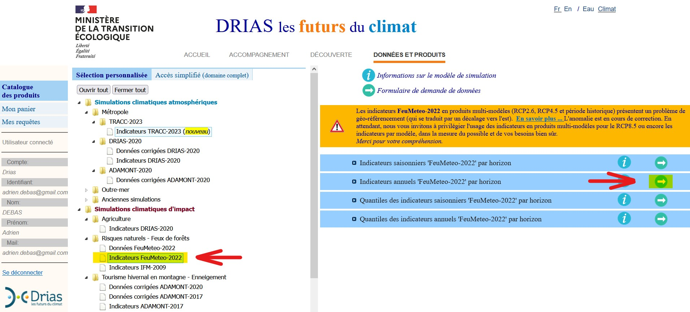
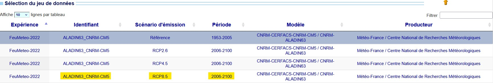
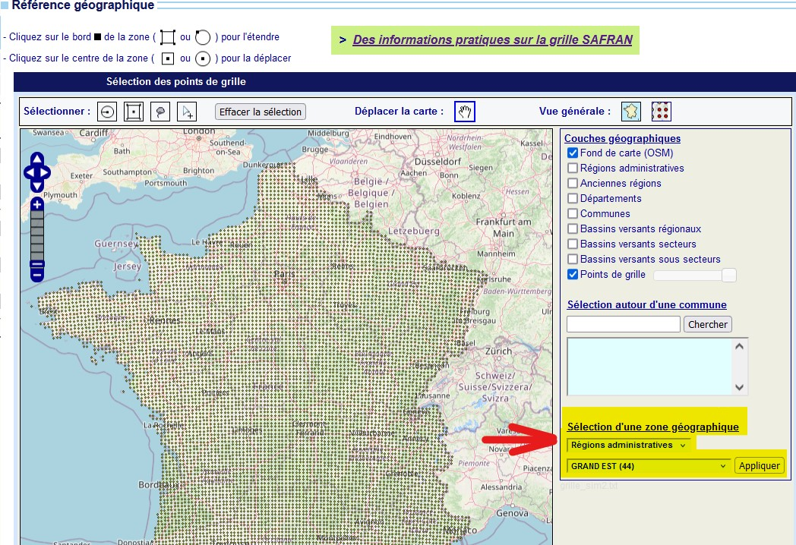
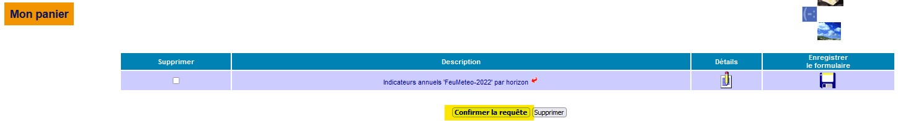

```{r setup, include=FALSE}
knitr::opts_chunk$set(echo = TRUE)
```

*Ce Rmd, une fois lancé, ouvre une page web invitant à sélectionner une zone géographique. Dans le cadre d'une lecture du GeoPackage sur un logiciel de SIG, et si les données SAFRAN correspondent à la région administrative Grand-Est, la zone sélectionnée doit se situer dans cette région. Pour une lecture des caractéristiques sur R directement, n'importe quelle zone en France peut être sélectionnée.*

```{r load_packages, include=FALSE}
library(happign)
library(raster)
library(terra)
library(dplyr)
library(stars)
library(readxl)
library(tmap)
library(mapedit)
library(tidyverse)
library(sf)
library(tinytex)
library(ggplot2)
```

```{r}
res <- list()
```

# Introduction

Les changements climatiques impliquent une augmentation du risque de feux de forêt en France ([`Lerat & Poss, 2021`](https://doi.org/10.20870/revforfr.2021.7209); [`Pimont et al., 2023`](https://hal.inrae.fr/hal-04149936)). L'anticipation est considérée comme un des leviers de la lutte contre les feux de forêt ([`Michaut, 2009`](https://hal.science/hal-03556263)). Les données que MeteoFrance met à disposition sur le [`portail DRIAS`](https://www.drias-climat.fr/commande) permettent d'anticiper le risque incendie à l'aide de la méthode canadienne d'Indice Feu Météorologique (IFM).

L'objectif de ce projet est d'étudier de quelle manière les données DRIAS peuvent être combinées aux données IGN dans une fonction R pour être utiles à la gestion forestière. La méthode de caractérisation du risque incendie sera présentée, ainsi que la manière dont les données ont été acquises puis traitées. Les sorties de la fonction seront ensuite détaillées, puis une partie de discussion des résultats et de proposition de réflexion sera abordée.

```{r set_x}
X <- mapedit::drawFeatures()
```

# Méthode

## Données DRIAS

### Présentation des données

La méthode d'Indice Feu Météorologique (IFM) permet de caractériser la propension d'un feu à s'aggraver et à se propager à l'aide de variables météorologiques (température, humidité de l'air, vitesse du vent et cumul des précipitations). L'IFM est ensuite représenté sur une maille [`SAFRAN`](https://doi.org/10.57745/1PDFNL) de 8 km par 8 km.

Deux manières de l'estimer sont possibles. La première consiste à se baser sur des relevés historiques pour calculer cet indice *a posteriori* ; la seconde consiste à utiliser des modèles climatiques pour simuler les conditions météorologiques du futur. Ces modèles se basent sur des hypothèses d'émissions de $CO_2$ dans l'atmosphère, exprimées en scénarios de forçage radiatif (Representative Concentration Pathway, RCP). Quatre trajectoires sont possibles : RCP 2.6, RCP 4.5, RCP 6.0 et RCP 8.5 de la plus à la moins optimiste.

Au-delà des scénarios RCP, plusieurs modèles sont disponibles, qui se différencient par leur prise en compte des processus à l'oeuvre dans le cadre des changements climatiques. Les scénarii de référence, basés sur des données historiques, diffèrent donc également. Onze modèles sont disponibles sur le portail DRIAS.

### Téléchargement des données

La méthode suivante a été appliquée pour télécharger les données DRIAS :

1.  Créer un compte sur l'[`espace de Données et Produits du portail DRIAS`](https://www.drias-climat.fr/commande)`.`

2.  Sur la page "Catalogue des produits", sélectionner "Indicateurs FeuMeteo-2022" dans le sous-dossier "Risques Naturels - Feux de forêts".

    

3.  Un formulaire de téléchargement s'ouvre.

    -   La partie **Sélection du jeu de données** consiste à choisir le modèle climatique utilisé pour représenter les conditions climatiques. Le présent projet se base sur le modèle MeteoFrance ALADIN63, pour le RCP 8.5 qui correspond à la trajectoire actuelle d'émissions de gaz à effet de serre. Son intérêt est d'être un modèle régional de climat se basant sur les données d'observations [`SAFRAN`](https://recherche.data.gouv.fr/fr/jeu-de-donnee/geopackage-des-mailles-safran-meteo-france-en-france-metropolitaine-integrant-des-variables-administratives-agricoles-et-hydriques). Ces observations concernent la France métropolitaine selon un maillage de 8 km x 8 km.

        

    -   La partie **Référence temporelle** permet de déterminer l'horizon temporel des données à charger. Pour le modèle de référence, seule la période de référence est disponible. Pour les modèles projetés, les horizons proche (2021-2050), moyen (2041-2070) et lointain (2071-2100) sont disponibles. Pour ce projet, les indices IFM pour les trois horizons sont téléchargés.

    -   La partie **Référence géographique** permet de sélectionner les mailles SAFRAN dans lesquelles les données DRIAS sont stockées. Pour ce projet, les mailles sont sélectionnées à l'aide des menus déroulants de la partie **Sélection d'une zone géographique**. Elles correspondent à la région administrative Grand-Est (902 mailles), mais les mailles sur la France entière peuvent également être téléchargées. Cliquer sur **Appliquer** pour valider la sélection.

        {width="594"}

    -   La partie **Indicateurs météorologiques** permet de sélectionner les variables à télécharger. Pour ce projet, seule la variable *IFMx moyen* est utilisée. Elle correspond à l'Indicateur de Feu Météorologique, retravaillé par MeteoFrance pour correspondre à la valeur maximale journalière. Comme ce projet se base sur les indicateurs annuels, ces valeurs sont moyennées sur l'année.

        Pour sélectionner la variable, cliquer sur le menu déroulant **Indicateurs 'Feu-Météo'...** et sélectionner la variable d'intérêt. La boîte **Indicateurs sélectionnés** rappelle le nombre de variables sélectionnées.

        {width="440"}

    -   La partie **Validation du formulaire de commande** permet enfin de valider la sélection.

4.  La fenêtre **Mon panier** s'ouvre (cliquer sinon sur le menu **Mon panier** en haut à gauche). Pour envoyer la demande, cliquer sur **Confirmer la requête**.

    

5.  Cliquer ensuite sur le menu **Mes requêtes \> Requêtes en cours...** pour afficher le statut de la demande. Une fois le statut défini sur *Arrivé*, cliquer sur l'icône *TXT* à droite pour télécharger le fichier .txt contenant les données IFMx des grilles sélectionnées.

    

6.  Si le fichier .txt s'ouvre dans une fenêtre du navigateur, faire un Clic droit \> Enregistrer sous... pour enregistrer le fichier .txt.

    Le code R qui suit permet de lire les données.

### Présentation du GeoPackage des mailles SAFRAN

La maille SAFRAN sur laquelle sont projetées les données DRIAS est téléchargée pour pouvoir les vectoriser. Des tentatives de reconstruction de la maille ont été réalisée, à partir des coordonnées DRIAS (points des centres de mailles). Ces tentatives infructueuses apparaissent dans la partie **Discussion**. La méthode la plus efficace reste de télécharger le GeoPackage des mailles SAFRAN disponibles sur le site [`recherche.data.gouv`](https://entrepot.recherche.data.gouv.fr/dataset.xhtml?persistentId=doi:10.57745/1PDFNL), puis de joindre les deux objets spatiaux. En effet, les données du GeoPackage SAFRAN sont spatialisées par des polygones, qui reprennent les coordonnées des angles et du centre de chaque maille. Les correspondances entre les points DRIAS et les centres de polygones SAFRAN permet la jointure des deux jeux de données, et donc de spatialiser les indicateurs DRIAS.

Outre la spatialisation des mailles, le jeu de données SAFRAN est composé de données climatologiques historiques (occupation de la maille en type d'utilisation des terres, réserve utile, profondeur du sol, altitude, région administrative, département...). Ces données ne sont pas utilisées ici, l'objectif étant d'affiner les indicateurs DRIAS (à la maille SAFRAN) à l'aide de descriptions des peuplements à une résolution plus fine.

### Lecture des données DRIAS sur R

La fonction suivante permet de lire les données DRIAS et retourne un GeoPackage ayant pour couches les données DRIAS aux horizons i) proche, ii) moyen et iii) lointain.

Elle prend en entrée un dataframe construit à partir du fichier .txt téléchargé sur le portail DRIAS, ainsi que le GeoPackage des mailles SAFRAN en France métropolitaine :

```{r lecture_donnees, message=FALSE, warning=FALSE, include=FALSE}
indices_feu <- read.table(
  "indicesALADIN63_CNRM-CM5_24090913012904838.KEYuAuU7dD1Uudu0Od00fOx.txt",
  sep = ";",
  quote = "\""
)

safran <- st_read("safran.gpkg")
```

L'objectif de cette fonction est de référencer les données IFMx sur la maille SAFRAN. Elle commence par assigner le système de coordonnées Lambert 93 aux deux objets `sf`, puis elle les joint par correspondance entre les points DRIAS et les polygones SAFRAN. Seules les dalles avec des valeurs pour la variable IFMx sont conservées, puis le jeu de données est divisé selon les trois horizons temporels.

Une couche raster est enfin créée pour chaque horizon temporelle, puis ajoutée au GeoPackage principal.

```{r fonction_donnees_drias}
get.drias.gpkg <-
  function(safran = safran,
           indices_feu = indices_feu,
           nomGPKG) {
    # Transformation de indices_feu au format sf ----
    
    indices_feu_sf <-
      st_as_sf(indices_feu, coords = c("V3", "V2"), crs = 4326)
    
    # indices_feu_sf <- terra::project(indices_feu_sf, "EPSG:2154")
    # La projection à l'aide de la fonction terra::project ne fonctionne pas
    # pour les objets sf
    
    indices_feu_sf <- st_transform(indices_feu_sf, crs = 2154)
    
    #  Reprojection de la couche safran en L93 ----
    
    safran <- st_transform(safran, crs = 2154)
    
    # Jointure des couches safran et drias ----
    
    safran_drias <- st_join(safran, indices_feu_sf)
    
    # La ligne suivante conserve uniquement les lignes qui contiennent des
    # données DRIAS.
    
    safran_drias <- safran_drias[!is.na(safran_drias$V1),]
    
    # Arrondi des indicateurs à l'unité (V12 est la variable IFMx)
    
    safran_drias$V12 <- round(safran_drias$V12, 0)
    safran_drias$V12 <- as.integer(safran_drias$V12)
    
    
    # Séparation de la couche DRIAS selon les trois horizons
    
    safran_drias_proche <- safran_drias[safran_drias$V5 == "H1",]
    safran_drias_moyen <- safran_drias[safran_drias$V5 == "H2",]
    safran_drias_lointain <- safran_drias[safran_drias$V5 == "H3",]
    

    # Rasterisation des couches DRIAS    
    
    raster_drias_proche <-
      stars::st_rasterize(safran_drias_proche %>%
                            dplyr::select(V12,
                                          location))
    raster_drias_moyen <-
      stars::st_rasterize(safran_drias_moyen %>%
                            dplyr::select(V12,
                                          location))
    raster_drias_lointain <-
      stars::st_rasterize(safran_drias_lointain %>%
                            dplyr::select(V12,
                                          location))
    
    # Passage du format stars au format SpatRaster
    
    raster_drias_proche <- as(raster_drias_proche, "SpatRaster")
    raster_drias_moyen <- as(raster_drias_moyen, "SpatRaster")
    raster_drias_lointain <- as(raster_drias_lointain, "SpatRaster")
    
    
    # Ecriture des couches raster dans un geopackage ----
    
    writeRaster(
      raster_drias_proche,
      paste0(nomGPKG, ".gpkg"),
      filetype = "GPKG",
      gdal = c(
        "APPEND_SUBDATASET=YES",
        "RASTER_TABLE=IFMX_RCP8_5_PROCHE"
      )
    )
    writeRaster(
      raster_drias_moyen,
      paste0(nomGPKG, ".gpkg"),
      filetype = "GPKG",
      gdal = c("APPEND_SUBDATASET=YES",
               "RASTER_TABLE=IFMX_RCP8_5_MOYEN")
    )
    writeRaster(
      raster_drias_lointain,
      paste0(nomGPKG, ".gpkg"),
      filetype = "GPKG",
      gdal = c(
        "APPEND_SUBDATASET=YES",
        "RASTER_TABLE=IFMX_RCP8_5_LOINTAIN"
      )
    )
  }
```

## Prise en compte de l'inflammabilité

Le premier facteur choisi pour caractériser le risque incendie est l'inflammabilité des peuplements. Cela correspond à la propriété d'une essence caractérisant sa capacité à s'enflammer lorsqu'elle est soumise à un échauffement.

La notion d'inflammabilité ainsi que l'analyse de ses variations est fondamentale pour le suivi de l'évolution du risque d'éclosion d'incendies en fonction de la composition des peuplements. La hiérarchisation de ce facteur de risque en fonction des essences constitue donc une première étape dans la cartographie de zones à risque ([`JC Valette, 1990`](https://hal.science/hal-03425168/document)).

En s'inspirant des données du travail de JC Valette, la hierarchie des essences a été faite de manière simplifiée en s'appuyant sur les données fournies par l'IGN pour caractériser les peuplements (tfv_g11). Ainsi sont prises en comptes, d'un côté, les forêts de feuillus ouvertes et fermées et d'un autre les forêts de conifères ouvertes et fermées. Des cas particuliers ont été pris en compte pour les forêts à peuplement mixte, les landes et les peupleraies (le risque étant quasi nul en ripisylve). Une note particulière dans le champ des unités a été attribuée pour chacun des peuplements de la zone sélectionée, caractérisant ainsi leur inflammabilité. La fonction ci-dessous renvoie ainsi les peuplements de la zone comme des objets raster.

```{r fonction - inflammibilite}
peuplement_inflammabilite <- function(X) {
  pplt_aleatoire <-
    happign::get_wfs(X, "LANDCOVER.FORESTINVENTORY.V2:formation_vegetale")
  
  pplt_aleatoire$inflammability <- ifelse(
    pplt_aleatoire$tfv_g11 == "Forêt fermée feuillus",
    2,
    ifelse(
      pplt_aleatoire$tfv_g11 == "Forêt fermée sans couvert arboré",
      1,
      ifelse(
        pplt_aleatoire$tfv_g11 == "Forêt ouverte feuillus",
        3,
        ifelse(
          pplt_aleatoire$tfv_g11 == "Forêt fermée conifères",
          7,
          ifelse(
            pplt_aleatoire$tfv_g11 == "Forêt ouverte conifères",
            8,
            ifelse(
              pplt_aleatoire$tfv_g11 == "Lande",
              5,
              ifelse(pplt_aleatoire$tfv_g11 == "Peupleraie", 1, 5)
            )
          )
        )
      )
    )
  )
  
  
  inflama_raster <- stars::st_rasterize(pplt_aleatoire %>%
                                          dplyr::select(inflammability, geometry))
  
  return(inflama_raster)
}
```

## Prise en compte du facteur combustibilité

L'inflammabilité n'est pas un facteur suffisant pour caractériser le risque incendie à l'échelle des peuplements d'une zone. En effet, certaines essences peuvent être très facilement inflammables mais pas nécessairement très combustibles, c'est à dire ayant la propriété de brûler en se combinant avec l'oxygène de l'air ou un autre comburant. Ce sont les feuillus qui ont le plus fort pouvoir calorifique et ainsi la meilleure capacité de combustibilité. La méthode de sélection, d'attribution d'une note (dans le champ des dizaines) pour hiérarchiser les peuplements en fonction du risque ainsi que la rastérisation des couches s'effectuent de la même façon que pour l'inflammabilité.

```{r fonction combustibilite}
peuplement_combustibilite <- function(X) {
  pplt_aleatoire <-
    happign::get_wfs(X, "LANDCOVER.FORESTINVENTORY.V2:formation_vegetale")
  
  pplt_aleatoire$combustibility <- ifelse(
    pplt_aleatoire$tfv_g11 == "Forêt fermée feuillus",
    80,
    ifelse(
      pplt_aleatoire$tfv_g11 == "Forêt fermée sans couvert arboré",
      75,
      ifelse(
        pplt_aleatoire$tfv_g11 == "Forêt ouverte feuillus",
        70,
        ifelse(
          pplt_aleatoire$tfv_g11 == "Forêt fermée conifères",
          30,
          ifelse(
            pplt_aleatoire$tfv_g11 == "Forêt ouverte conifères",
            20,
            ifelse(
              pplt_aleatoire$tfv_g11 == "Lande",
              50,
              ifelse(pplt_aleatoire$tfv_g11 == "Peupleraie", 70, 50)
            )
          )
        )
      )
    )
  )
  
  combusti_raster <- stars::st_rasterize(pplt_aleatoire %>%
                                           dplyr::select(combustibility, 
                                                         geometry),)
  return(combusti_raster)
}

```

## Importance de la desserte forestière

La donnée sur les dessertes nous sera utile en tant que facteur de lutte contre les incendies.

Objectif principal : ajouter à la fonction principale une sous-fonction desserte qui va afficher les dessertes avec des scores différents selon leur nature.

Objectif du code : écrire un code qui va chercher la donnée desserte sous forme vectorielle depuis `happign()`, y attribuer un score, puis la convertir en raster.

Premièrement, il faudra trier les différentes natures de dessertes et ne garder que celles qui sont utiles pour la DFCI (exclure les sentiers et les pistes). On utilisera la fonction `subset()`.

Deuxièmement, on attribue un score à chaque type de route selon la facilité d'accès et de circulation.

Troisièmement, on rastérise cette sous-fonction afin de pouvoir additionner les couches plus tard.

```{r fonction desserte}
fonction_desserte <- function (X) {
  desserte <- happign::get_wfs(X, "BDTOPO_V3:troncon_de_route")
  
  desserte_accessible_V <- subset(desserte, nature != "Sentier")
  
  desserte_accessible_V <-
    subset(desserte_accessible_V, nature != "Escalier")
  
  desserte_accessible_V$score[desserte_accessible_V$nature == "Route empierrée"] <-
    5
  
  desserte_accessible_V$score[desserte_accessible_V$nature == "Route à 1 chaussée"] <-
    2
  
  desserte_accessible_V$score[desserte_accessible_V$nature == "Route à 2 chaussées"] <-
    1
  
  desserte_accessible_V$score[desserte_accessible_V$nature == "Chemin"] <-
    9
  
  raster_desserte <- st_rasterize(desserte_accessible_V %>%
                                    dplyr::select(score))
  
  return(raster_desserte)
}
```

## Importance des axes routiers principaux

La donnée sur les axes principaux nous sera utile comme facteur de risque dans l'évaluation des risques d'incendies. En effet, E. Lafarge ([`2006`](https://infodoc.agroparistech.fr/visionneuse.php?lvl=afficheur&explnum=4152#page/19/mode/1up)) estime que 50% des feux se déclarent à moins de 50 mètres d'une voie carrossable, et 40% à moins de 50 mètres d'une habitation.

L'objectif principal : créer une sous-fonction qui va afficher les axes routiers principaux, comme les autoroutes et les départementales, et leur attribuer un score de risque.

Objectif du code : écrire un code qui va chercher la donnée des axes principaux sous forme vectorielle depuis `happign()`, y attribuer un score, puis la rastériser.

Premièrement, il faudra trier les différents types de routes en utilisant la fonction `subset()` afin de ne garder que les axes principaux (on supprime les voies cyclables et les pistes vertes).

Deuxièmement, on attribue un score aux axes principaux pour évaluer leur impact sur le risque d'incendie. Ce score sera additionné à celui des dessertes.

Troisièmement, on rasterise cette sous-fonction afin de pouvoir additionner les couches plus tard.

```{r fonction axes_principaux}
fonction_axes_principaux <- function(X) {
  route <- happign::get_wfs(X,
                            "BDTOPO_V3:route_numerotee_ou_nommee")
  
  route_departementale <-
    subset(route, type_de_route == "Départementale")
  
  route_autoroute <- subset(route, type_de_route == "Autoroute")
  
  route_nommée <- subset(route, type_de_route == "Route_nommée")
  
  route_intercommunale <-
    subset(route, type_de_route == "Route intercommunale")
  
  route_européenne <-
    subset(route, type_de_route == "Route européenne")
  
  Axe_principaux <- rbind(route_departementale,
                          route_autoroute,
                          route_intercommunale,
                          route_nommée)
  
  Axe_principaux$score[Axe_principaux$type_de_route == "Départementale"] <-
    2
  
  Axe_principaux$score[Axe_principaux$type_de_route == "Autoroute"] <-
    2
  
  Axe_principaux$score[Axe_principaux$type_de_route == "Route_nommée"] <-
    1
  
  Axe_principaux$score[Axe_principaux$type_de_route == "Route intercommunale"] <-
    1
  
  Axe_principaux$score[Axe_principaux$type_de_route == "Route européenne"] <-
    1
  
  #Axes_principaux_buff <- st_buffer(Axe_principaux, 15)
  
  raster_Axe_principaux <- stars::st_rasterize(Axe_principaux %>%
                                                 dplyr::select(score))
  
  
  
  return(raster_Axe_principaux)
}
```

## Prise en compte des bâtiments à risque

Il semble également important de repérer et de classifier les bâtiments dans les zones forestières sélectionnées pour prendre en compte le risque matériel et implicitement humain dans les zones à risque. Pour cela, l'utilisation de la BDTOPO bâtiments de l'IGN a été privilégiée pour repérer les bâtiments de la zone (identique à celle précédemment sélectionnée). Une zone buffer de 50 m autour des infrastructures sélectionnées a été faite pour matérialiser le risque géographique lié aux incendies et à leur propagation. Pour catégoriser le risque de façon plus précise et plus simple afin de lui créer une note, un comptage des bâtiments appartenant à une même zone buffer a été effectué aboutissant à 3 classes de bâtis : isolé (moins de 3 bâtiments dans la zone buffer), diffus (entre 3 et 50 bâtiments) ou sans classe (plus de 50). Ces zones buffer sont ensuite rasterisées pour être visualisées via un fichier tif.

```{r sous-fonction bâtiments sensibles}
fonction_bat <- function (X,
                          buffer = 50) {
  batiment <- happign::get_wfs(X, "BDTOPO_V3:batiment")
  print(st_crs(batiment))
  
  batiment_buf <- st_buffer(x = batiment, 50)
  
  intersections <- st_intersects(batiment_buf, batiment)
  
  batiment_buf$nb_batiments <- lengths(intersections)
  
  batiment_buf$classe_bâtis <- ifelse(
    batiment_buf$nb_batiments <= 3,
    "bâtis isolé",
    ifelse(
      batiment_buf$nb_batiments <= 50,
      "bâtis diffus",
      "bâtis sans classe"
    )
  )
  
  batiment_buf$score <- case_when(
    batiment_buf$classe_bâtis == "bâtis isolé" ~ 1,
    batiment_buf$classe_bâtis == "bâtis diffus" ~ 2,
    batiment_buf$classe_bâtis == "bâtis sans classe" ~ 3
  )
  
  raster_batiment <- stars::st_rasterize(batiment_buf %>%
                                           dplyr::select(score))
  write_stars(raster_batiment, "batiment.tif")
  
  return(raster_batiment)
}
```

## Création d'un leaflet pour une représentation interactive des résultats

Un leaflet a été créé pour rendre la visualisation des rasters plus accessible pour les gestionnaires utilisant R. Le code est représenté ci-dessous et la carte est visible depuis l'onglet "Viewer" sur R.

```{r}
# Affichage des couches sur Leaflet ----

carte_risques <- function(X) {
 
  
  # charge les rasters et les convertir en SpatRaster pour les utiliser
  
  inflama_raster <- as(peuplement_inflammabilite(X), "SpatRaster")
  combusti_raster <- as(peuplement_combustibilite(X), "SpatRaster")
  raster_desserte <- as(fonction_desserte(X), "SpatRaster")
  raster_batiment <- as(fonction_bat(X), "SpatRaster")
  raster_Axe_principaux <- as(fonction_axes_principaux(X), "SpatRaster")
  
  map <- leaflet() %>%
    addTiles() %>%
    addRasterImage(inflama_raster, opacity = 0.8, 
                   group = "inflama_raster") %>%
    addRasterImage(combusti_raster, opacity = 0.8, 
                   group = "combusti_raster") %>%
    addRasterImage(raster_desserte, opacity = 0.8, 
                   group = "raster_desserte") %>%
    addRasterImage(raster_batiment, opacity = 0.8, 
                   group = "raster_batiment") %>%
    addRasterImage(raster_Axe_principaux,
                   opacity = 0.8,
                   group = "raster_Axe_principaux") %>%
    addLayersControl(
      overlayGroups = c(
        "inflama_raster",
        "combusti_raster",
        "raster_desserte",
        "raster_batiment",
        "raster_Axe_principaux"
      ),
      options = layersControlOptions(collapsed = FALSE)
    )
  map
  
  addMouseCoordinates(map) %>%  
    # Ajout des coordonnées GPS du pointeur de la souris
    addResetMapButton() %>%  # ajout du bouton "reset" pour recentrage carte
    addFullscreenControl() %>% # ajout du basculement en mode plein écran
    addSearchOSM() %>% # ajout de la barre de recherche Openstreetmap
    
    addMiniMap(toggleDisplay = FALSE) # posibilité de réduite la minimap
  
}
```

# Résultats

## Rasters DRIAS obtenus

Les rasters DRIAS obtenus sont les suivants, aux horizons proche, moyen et lointain respectivement :

```{r echo=FALSE}
indices_feu_sf <-
      st_as_sf(indices_feu, coords = c("V3", "V2"), crs = 4326)

indices_feu_sf <- st_transform(indices_feu_sf, crs = 2154)
    
safran <- st_transform(safran, crs = 2154)

safran_drias <- st_join(safran, indices_feu_sf)
    
safran_drias <- safran_drias[!is.na(safran_drias$V1),]

safran_drias$V12 <- round(safran_drias$V12, 0)
safran_drias$V12 <- as.integer(safran_drias$V12)

    
    safran_drias_proche <- safran_drias[safran_drias$V5 == "H1",]
    safran_drias_moyen <- safran_drias[safran_drias$V5 == "H2",]
    safran_drias_lointain <- safran_drias[safran_drias$V5 == "H3",]
    
    raster_drias_proche <-
      stars::st_rasterize(safran_drias_proche %>%
                            dplyr::select(V12,
                                          location))
    raster_drias_moyen <-
      stars::st_rasterize(safran_drias_moyen %>%
                            dplyr::select(V12,
                                          location))
    raster_drias_lointain <-
      stars::st_rasterize(safran_drias_lointain %>%
                            dplyr::select(V12,
                                          location))
    
    plot(raster_drias_proche)
    plot(raster_drias_moyen)
    plot(raster_drias_lointain)
```

## Prise en compte de l'inflammabilité et de la combustibilité

La fonction permet de sortir des rasters représentant l'inflammabilité, comme celui-ci, défini autour de Nancy :

```{r echo=FALSE, message=FALSE, warning=FALSE}
plot(peuplement_inflammabilite(X))
```

Pour la même zone, le raster représentant la combustibilité créé est le suivant :

```{r echo=FALSE, message=FALSE, warning=FALSE}
plot(peuplement_combustibilite((X)))
```

## Représentation de la desserte et des axes routiers

Le raster de sortie représentant les dessertes est le suivant :

```{r echo=FALSE, message=FALSE, warning=FALSE}
plot(fonction_desserte(X))
```

Le raster de sortie représentant les axes principaux est le suivant :

```{r echo=FALSE, message=FALSE, warning=FALSE}
plot(fonction_axes_principaux(X))
```

## Représentation des bâtiments

Les bâtiments et le risque incendie associé sont représentés par le raster suivant :

```{r echo=FALSE, message=FALSE, warning=FALSE}
plot(fonction_bat(X))
```

## Création d'un fichier GeoPackage avec tous les rasters

Tous les rasters produits par les sous-fonctions ont été compilés dans un fichier .gpkg grâce à la fonction `addtion_gpkg()`.

```{r}
addition_gpkg <- function(X = mapedit::drawFeatures(), 
                          nomGPKG){
  
  liste_fonctions <- list(peuplement_inflammabilite, 
                          peuplement_combustibilite,
                          fonction_desserte,
                          fonction_bat,
                          fonction_axes_principaux
  )
  liste_raster <- lapply(liste_fonctions, function(f) f(X))
  liste_raster_conv <- lapply(liste_raster, function(raster) 
    as(raster, "SpatRaster"))
  
  # créer un géopackage avec tous les rasters
  
for (i in 1:length(liste_raster_conv)) {
    # Créez un nom de couche basé sur l'index ou un autre critère
    layer_name <- paste0("layer_", i)  # Par exemple, "layer_1", "layer_2", etc.
    
    # Écrire l'objet Raster dans le GeoPackage avec un nom de couche dynamique
    writeRaster(liste_raster_conv[[i]],
                paste0(nomGPKG, ".gpkg"),
                filetype = "GPKG",
                gdal = c("APPEND_SUBDATASET=YES",
                         paste0("RASTER_TABLE=", layer_name)))}
  get.drias.gpkg(safran, indices_feu, nomGPKG)
  
  return()}
```

On a ainsi, lorsque la fonction `addition_gpkg()` est lancée, un fichier au format .gpkg avec à l'intérieur l'ensemble des rasters créés :

-   layer 1 : raster cartographiant l'aléa inflammabilité des peuplements.

-   layer 2 : raster cartographiant l'a'aléa combustibilité des peupelements.

-   layer 3 : raster cartographiant les dessertes.

-   layer 4 : raster cartographiant les enjeux au niveau des habitations.

-   layer 5 : raster cartographiant les axes routiers principaux augmentant le risque de départ incendie.

-   layer 6, 7, 8 : raster cartographiant les couches DRIAS aux horizons proche, moyen et lointains.

## Un raster qui combine l'ensemble des critères énumérés plus haut

L'ensemble des facteurs d'aléa et de vulnérabilité sont combinés pour donner un raster final qui cartographie le risque sur la zone étudiée. Il s'agit de la fonction `addition()` qui effectue cette manipulation. Celle-ci applique l'ensemble des sous-fonctions définies plus haut à une zone sélectionnée par l'opérateur. L' ensemble des rasters produits sont rééchantillonnés à la même résolution que le raster issu de la sous-fonction traitant de l'inflammabilité des peuplements. Une fois tous les rasters à la même résolution, ces derniers sont additionnés et forment un seul raster.

```{r}
# Addition des données raster en un seul raster
 
addition <- function(){
  X = mapedit::drawFeatures()
  liste_fonctions <- list(peuplement_inflammabilite, 
                          peuplement_combustibilite,
                          fonction_desserte,
                          fonction_bat,
                          fonction_axes_principaux
                          )
  liste_raster <- lapply(liste_fonctions, function(f) f(X))
  
  liste_raster_resampled <- lapply(liste_raster, function(raster) 
    st_warp(raster, liste_raster[[1]]))
  
  
  # Initialiser un raster vide pour stocker la somme
  raster_somme <- liste_raster_resampled[[1]]  # Crée un raster vide basé sur le premier raster
  
  # Boucle pour additionner tous les rasters
  for (i in 2:length(liste_raster_resampled)) {
    raster_somme <- raster_somme + liste_raster_resampled[[i]]
  }
  return(raster_somme)}

```

Concernant la fonction `addition()`, le raster final renvoyé ne semble pas fonctionner comme prévu, en effet lors de la visualisation du raster, ce dernier ne s'affiche pas comme souhaité.

# Discussion

L'objectif était de cartographier les risques incendies sur une zone donnée. En prenant en compte différents critères caractérisant l'aléa et les enjeux, des couches au format raster ont pu être générées. Cependant, la combinaison de ces rasters pour former un raster final représentant les risques incendies n'a pas pu être aboutie. Des problèmes liés à la résolution des données raster ont été rencontrés. Avec un réechantillonnage des rasters, cela a pu être corrigé en partie.

Par ailleurs, la combinaison des rasters a posé des problèmes notamment en termes de valeurs NA comptées et de compatibilité des formats (SpatRaster, Stars...). Avec un peu plus de temps, l'assemblage des rasters aurait pu être fait correctement avec une fonction adéquate. Ce problème a pu être contourné par la fonction `as()` permettant de changer de format (de `Stars` à `SpatRaster` notamment).

De même, la représentation des axes routiers principaux est trop grossière une fois raterisée. Cela pose des problèmes dans la représentation des routes et la superposition avec les autres rasters. Par ailleurs le package `stars` a été utilisé plutôt que le package `terra` car cela semblait mieux marcher et plus pratique. L'utilisation du package terra aurait été cependant plus adapté notamment d'un point de vue compatibilité car `stars` est obsolète.

De plus, concernant le cadrage de la zone, les rasters ne semblent pas tous avoir les mêmes délimitations alors que les sous-fonctions prennent pourtant la même zone. Enfin une réflexion a été entammée mais non finalisée sur la prise en compte des différents enjeux et aléas dans la représentation des risques. Chaque critère étudié est en effet traduit dans la zone étudiée en pixels avec un score associé. Quel score associer à chaque critère ? Il semble intéressant de prioriser certains critères comme les indices issus de DRIAS, ou bien ceux issus de l'inflammabilité des peuplements en leur donnant un score plus important que les autres critères. Cela permettrait lors de la combinaison des rasters de mieux les représenter.

Des données sur les vents peuvent être intéressantes à modéliser à une échelle plus fine, par exemple en se basant sur les reliefs. Cependant, les données DRIAS prennent déjà en compte les vents, donc ils n'ont pas été réutilisés dans cette étude.

Un inconvénient pour les rasters DRIAS sortis et qu'ils nécessitent un travail sur un logiciel de SIG pour harmoniser la symbologie. Une piste de progression pour le code pourrait être de l'automatiser. La lecture des dalles DRIAS sur R n'est pas optimale. Le raster est visible, mais une solution pour découper le maillage SAFRAN afin qu'il corresponde aux autres couches sur R n'a pas encore pu être mise en place.

Enfin, sélectionner des zones sans routes peut conduire la fonction principale à planter, ce qui représente une autre piste de progression.
