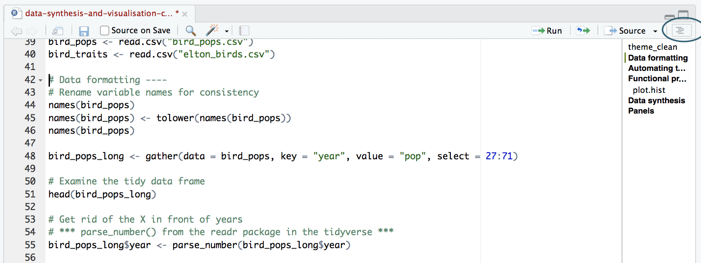
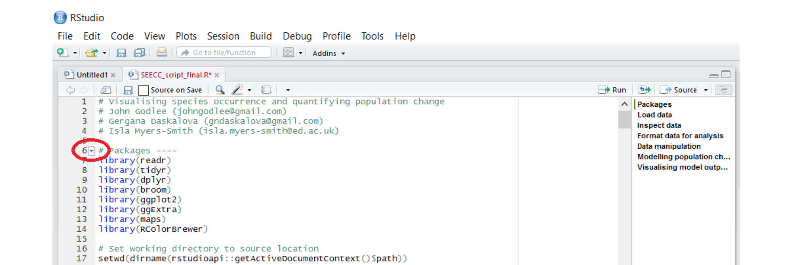
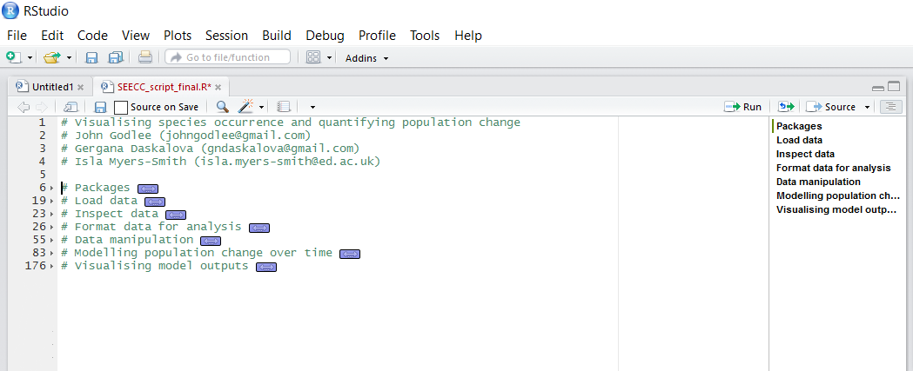
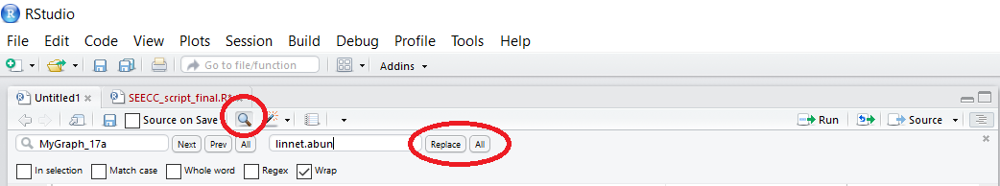

<!-- :240903:gf:r:enseignement: -->

# Étiquette de codage : Écrire un code clair, informatif et facile à utiliser

Lorsque vous analysez des données dans R, les lignes de code peuvent rapidement s'accumuler : des centaines de lignes à parcourir, 
de nombreux objets dont les noms peuvent avoir un sens pour vous, mais pas pour d'autres personnes ou pour vous à l'avenir.
Cette partie offre des conseils sur la manière de rendre votre code facile à lire et à comprendre, 
pour vous-même et pour ceux qui voudront lire votre code à l'avenir. 

> Le respect d'une étiquette de codage, c'est-à-dire d'un ensemble de « règles » que vous suivez de manière cohérente tout au long de votre travail, 
> améliorera votre flux de travail R et réduira l'apparition d'erreurs gênantes.

L'étiquette de codage décrite dans cette partie s'applique à la plupart des analyses et, en grande partie, à d'autres langages de programmation.
Elle est cependant d'autant plus importante que le langage de programmation est R. 
En effet, R est un langage qui n'impose aucun format particulier, contrairement à d'autres langages comme Pyhton qui, pour fonctionner, peuvent
nécessiter un alinéa dans les boucles, des retours à la ligne, etc.
Avec R, sans règles de forme du code, un script peut vite devenir un enfer à lire et à ré-employer, pour celui qui le reprend ou pour celui qui l'a écrit.

Appliquez-vous à respecter scrupuleusement ces règles lors des TDs qui vous seront donnés, et, surtout, lors des projets que vous mènerez lors
de cette UE, lors de cette année, et tout au long de votre vie professionnelle.

# Organiser les scripts en sections

Comme pour tout travail d'écriture, il est très utile d'avoir une structure claire pour rédiger un script R. 
Un script est un fichier `.R` qui contient votre code : vous pourriez taper directement le code dans la console R, 
mais vous n'en garderiez aucune trace et vous ne pourriez pas le réutiliser plus tard. 
Pour créer un nouveau fichier `.R`, ouvrez RStudio et allez dans `File/New file/R script`. 
Un script clairement structuré permet au rédacteur et au lecteur de naviguer facilement dans le code pour trouver la section souhaitée.

La meilleure façon de diviser votre script en sections est d'utiliser des commentaires. 
Vous pouvez définir un commentaire en ajoutant `#` au début de n'importe quelle ligne et en tapant du texte après, 
par exemple `# ggplot of diameter distribution`. 
Sous ce commentaire, vous écrirez le code pour créer votre graphique à l'aide de ggplot. 
RStudio dispose d'une fonctionnalité intéressante qui vous permet de transformer vos sections en un plan, 
similaire à celui que vous pouvez trouver dans Microsoft Word. 
Pour ajouter un commentaire au plan, tapez quatre `-` après votre texte de commentaire, par exemple `# ggplot of diameter distribution ----`. 
Pour visualiser votre plan, cliquez sur le bouton comme indiqué ci-dessous. 
Vous pouvez alors cliquer sur un élément du plan et y accéder directement : plus besoin de faire défiler la page !



NOTE : Si vous ne voyez pas l'icône de contour, vous n'avez probablement pas la dernière version de RStudio - 
si vous souhaitez bénéficier de cette fonctionnalité, vous pouvez [télécharger](https://www.rstudio.com/products/rstudio/download/) la dernière version de RStudio.

# Structure du script 

Il n'existe pas de règles strictes concernant le nombre et le nom des sections : vous pouvez adapter le contenu des sections à vos besoins, 
mais en général, un script comprend les sections suivantes :

**Introduction** : Déclaration de l'auteur (que fait ce script ?), nom de l'auteur ou des auteurs, coordonnées et date.

**Bibliothèques/Libraries** : Quels packages utilisez-vous pour ce script ? Conservez-les tous ensemble au début de votre script. 
Lorsque vous passez d'un script à l'autre, alors que vos packages sont déjà chargés, il est facile d'oublier de copier la bibliothèque, 
ce qui signifie que vous risquez de ne plus savoir pourquoi le code ne fonctionne plus. 
Votre bibliothèque sera encore plus instructive pour vous et pour les autres si vous ajoutez des commentaires sur l'utilisation de chaque package. 
Voici deux exemples, bons et mauvais, pour illustrer ces deux premières sections :

Une intro de script pas très utile :

```{r, eval=FALSE}
# My analysis
```

Une intro de script informative (source: [tutoriel du Coding Club](https://ourcodingclub.github.io/tutorials/etiquette/index.html#syntax)) :

```{r, eval=FALSE}
# Analysing vertebrate population change based on the Living Planet Index
# Data available from http://www.livingplanetindex.org/

# Gergana Daskalova ourcodingclub(at)gmail.com
# 25-04-2017

# Libraries ----
library(tidyr)      # Formatting data for analysis
library(dplyr)      # Manipulating data
library(ggplot2)    # Visualising results
library(readr)      # Manipulating data
```

Vous avez peut-être remarqué que lorsque vous créez une section en utilisant quatre ou plus `-` à la fin d'une ligne de commentaire, 
une petite flèche apparaît dans la marge à côté du commentaire. 
En cliquant sur ces flèches, vous pouvez réduire la section, ce qui est très utile lorsque vous parcourez un long texte.



Vous pouvez également aller dans `Edit/Folding/Collapse all` pour réduire toutes les sections. 
Il s'agit du plan de votre script et, à partir de là, vous pouvez naviguer jusqu'à la section dont vous avez besoin. 
`Expand all` affiche tout le code que vous avez écrit. Voici un exemple :



**Fonctions** : Utilisez-vous des fonctions écrites par vous et/ou par d'autres ? Définissez-les ici. 
Par exemple, des fonctions pour supprimer les valeurs NA, des fonctions pour créer votre propre thème ggplot2. 
Voici un exemple de section sur les fonctions :

```{r, eval=FALSE}
# Defining functions ----
# A custom ggplot2 function
theme.LPI <- function(){
  theme_bw()+
    theme(axis.text.x=element_text(size=12, angle=45, vjust=1, hjust=1),
          axis.text.y=element_text(size=12),
          axis.title.x=element_text(size=14, face="plain"),             
          axis.title.y=element_text(size=14, face="plain"),             
          panel.grid.major.x=element_blank(),                                          
          panel.grid.minor.x=element_blank(),
          panel.grid.minor.y=element_blank(),
          panel.grid.major.y=element_blank(),  
          plot.margin = unit(c(0.5, 0.5, 0.5, 0.5), units = , "cm"),
          plot.title = element_text(size=20, vjust=1, hjust=0.5),
          legend.text = element_text(size=12, face="italic"),          
          legend.title = element_blank(),                              
          legend.position=c(0.9, 0.9))
}
```

Si vous exécutez le code de la fonction `theme.LPI` ci-dessus, vous verrez le nom de la fonction que vous avez créée apparaître 
dans votre environnement global dans le coin supérieur droit de votre écran RStudio 
(il se peut que vous deviez faire défiler vers le bas les objets que vous avez créés). 
Une fois que vous avez créé une certaine fonction, RStudio s'en souviendra pour le reste de votre session. 
Si vous fermez RStudio et l'ouvrez à nouveau plus tard, vous devrez exécuter à nouveau le code de la fonction.

**REMARQUE : lorsque vous fermez RStudio, un message vous demande si vous souhaitez sauvegarder l'image de votre espace de travail.** 
**Si vous cliquez sur oui, la prochaine fois que vous ouvrirez RStudio, il ressemblera exactement à ce qu'il était lorsque vous l'avez fermé,** 
**avec les mêmes objets stockés dans votre environnement global. Si vous cliquez sur non, la prochaine fois que vous ouvrirez RStudio,** 
**vous devrez ouvrir votre script et exécuter le code à nouveau si vous souhaitez utiliser les mêmes objets.** 
**Personnellement, je ne sauvegarde pas souvent l'image de l'espace de travail, car cela ralentit l'exécution de RStudio et peut introduire des erreurs,**
**car vous risquez de confondre des objets provenant de différentes analyses et/ou d'écraser des objets sans vous en rendre compte.**

Concernant les fonctions, il est aussi possible de définir un script `functions.R` dans le dossier de travail, et d'appeler ce fichier en début de script d'analyse.
Pour ce faire, vous pouvez utiliser la function `source()` de la façon suivante :

```{r, eval=FALSE}
# Loading functions ----
source("path/to/functions.R")
```

**Définir le répertoire de travail/Working directory** : Il est utile de conserver toutes les données, les scripts, les images de sortie, etc. dans un seul dossier. 
Cela minimise le risque de perdre une partie de votre analyse et facilite le déplacement de l'analyse sur votre ordinateur sans rompre les chemins d'accès aux fichiers.
Notez que les chemins d'accès sont définis différemment sur les machines Mac/Linux et Windows. 
Sur une machine Mac/Linux, les fichiers utilisateur se trouvent dans le répertoire « home » (`~`), alors que sur une machine Windows, 
les fichiers peuvent être placés dans plusieurs « lecteurs » (par exemple `D :`). 
Notez également que sur une machine Windows, si vous copiez et collez un chemin de fichier de l'Explorateur Windows dans RStudio, 
il apparaîtra avec des barres obliques inverses (`\ `), mais R exige que tous les chemins de fichier soient écrits avec des barres obliques inverses (`/`), 
vous devrez donc les modifier manuellement. 
Voir ci-dessous quelques exemples pour Windows et Mac/Linux :

```{r, eval=FALSE}
# Set the working directory on Windows ----
setwd("D:/Work/coding_club/CC-etiquette-master")

# Set the working directory on Mac/Linux ----
setwd("~/Work/coding_club/CC-etiquette-master")
```

**Importation de données** : quelles données utilisez-vous et où sont-elles stockées ? Importez le fichier de données depuis votre répertoire de travail. 
Voici un exemple :

```{r, eval=FALSE}
# Import data ----
mydata <- read.csv("path/to/mydata.csv")
```

**Les différentes sections de votre analyse** : quel est le déroulement logique de votre analyse ? 
L'ordre dans lequel vous abordez votre analyse doit être cohérent. 
S'il s'agit d'un code pour un mémoire d'ingénieur, un chapitre de thèse ou un manuscrit, vous pouvez suivre le même ordre dans votre script. 
En voici un exemple sur la base du [tutoriel proposé par le coding club](https://ourcodingclub.github.io/tutorials/etiquette). 
Si vous copiez ces éléments dans un fichier de script, vous verrez apparaître les sections. 

```{r, eval=FALSE}
# Formatting data ----
LPI2 <- gather(LPI, "year", "abundance", 9:53)  # Transforming the data from wide to long format, some blank cells may disappear
	# gather function requires tidyr package
LPI2$year <- parse_number(LPI2$year)  # Do you see awkward Xs before all the years? This gets rid of them.
names(LPI2)  # Check what the different variables are called
names(LPI2) <- tolower(names(LPI2))  # Make all variable names lower case

# When manipulating data it's always good check if the variables have stayed how we want them
# Use the str() function
str(LPI2)

# Abundance is a character variable, when it should be numeric, let's fix that
LPI2$abundance <- as.numeric(LPI2$abundance)

# Calc summary stats for each biome in the LPI database ----
levels(LPI2$biome)  # list all biomes

LPI_biome_summ <- LPI2 %>%  # use of pipe operator
  group_by(biome) %>%  # Group by biome
  summarise(populations = n())  # Create columns, number of populations

# Visualising the number of populations in each biome with ggplot2 package ---- 
(barplot <- ggplot(LPI_biome_summ, aes(biome, color = biome, y = populations)) + geom_bar(stat = "identity") +  
  		theme.LPI() +                     # Use of personal theme function
  		ylab("Number of populations") +
  		xlab("Biome") +
		theme(legend.position = "none"))  # Removal of legend for simplicity
```

Notez que le fait de mettre tout votre code ggplot entre parenthèses () crée le graphique et l'affiche ensuite dans le visualiseur de tracé.
Si vous n'avez pas les crochets, vous avez seulement créé l'objet, mais vous ne l'avez pas visualisé. 
Vous devrez alors appeler l'objet de manière à ce qu'il soit affiché en tapant simplement `barplot` après avoir créé l'objet « barplot ».

**Les résultats de votre analyse** : N'oubliez pas de respecter le chemin d'accès aux fichiers, non seulement lors du chargement des données, 
mais aussi lors de la sortie des fichiers (par exemple, les fichiers `.Rdata`, `.csv` et tous les chiffres que vous souhaitez sauvegarder). 
Les fichiers `.csv` sont plus facilement transférables et peuvent être utilisés sur plusieurs plates-formes, 
tandis que les fichiers `.Rdata` sont plus compressés et plus rapides à utiliser. 
L'enregistrement des graphiques sous forme de fichiers `.pdf` est une meilleure pratique, 
car les fichiers `.pdf` sont vectoriels et ne perdent pas en qualité lorsque vous effectuez un zoom avant ou arrière. 
Les fichiers `.png`, quant à eux, sont faciles à insérer dans des documents texte et des présentations. 
L'idéal est donc d'enregistrer un fichier `.pdf` et un fichier `.png` de votre graphique. 
Il est également conseillé d'enregistrer les sorties images dans un sous-répertoire de votre répertoire de travail, par exemple `img/`. 
N'oubliez pas que vous devrez créer le dossier `img` manuellement avant d'y enregistrer des tracés :

```{r, eval=FALSE}
png(file="img/biome_pop.png", width = 1000, height = 2000)  # Note that png() uses pixel values for width and height
ggplot(LPI_biome_summ, aes(biome, color = biome, y = populations)) + geom_bar(stat = "identity") +
  		theme.LPI() +
  		ylab("Number of populations") +
  		xlab("Biome") +
		theme(legend.position = "none")
dev.off()  # This tells R you are done with the plotting and it can save the file

pdf(file="img/biome_pop.pdf",  width = 13.33, height = 26.66)  # pdf() uses inches
ggplot(LPI_biome_summ, aes(biome, color = biome, y = populations)) + geom_bar(stat = "identity") +
  		theme.LPI() +
  		ylab("Number of populations") +
  		xlab("Biome") +
		theme(legend.position = "none")
dev.off()
```

Notez que vous pouvez également sauvegarder les résultats de votre analyse à l'aide d'un autre package, `ggsave`, 
et vous pouvez vous référer à la [fin de ce tutoriel de visualisation de données](https://ourcodingclub.github.io/tutorials/datavis/index.html) 
pour un exemple de la manière de procéder.

# Respecter l'étiquette de la syntaxe de codage

## Nommer des fichiers et des objets.

Les noms de fichiers des scripts doivent être significatifs et se terminer par `.R`. 
Évitez les espaces et les caractères bizarres ! 
Ils peuvent causer des problèmes lors du téléchargement de fichiers sur Github 
et en général lorsque l'on essaie de localiser des fichiers à travers certains chemins d'accès.

```{r, eval=FALSE}
LPI_analysis_Apr_2017.R  # Nickel.

yet_another_script.R  # Mauvais. Il m'a fallu des heures pour retrouver le fichier lorsque j'en ai eu besoin un an plus tard.
```

> Les noms d'objets doivent être concis et informatifs.

Appeler vos objets `data` ou quelque chose d'aussi vague peut poser des problèmes si vous faites plusieurs analyses à la fois 
ou si vous ne nettoyez pas votre environnement régulièrement, car ces noms d'objets seront écrasés 
et peuvent perturber votre script si vous ne l'exécutez pas dans l'ordre.

Les noms d'objets longs sont fastidieux à taper. Plus de lettres = plus de chances de faire une faute de frappe.

Les noms d'objets, de variables (par exemple `object$variable`) et de fonctions doivent être en minuscules. 
`MinPrecip_august` est difficile à retenir, `min.precip.aug` est un peu long, mais informatif et plus facile à taper.

- **Les noms de variables doivent être des substantifs**, par exemple `diametre` ou `essence`.
- **Les noms de fonctions doivent être des verbes**, par exemple `calc.sp.richness`.
- **Utilisez un trait de soulignement pour séparer les mots dans un fichier de script**, par exemple `LPI_analysis_Apr_2017.R`
- **La forme préférée pour les noms d'objets/variables est celle de lettres minuscules et de mots séparés par des traits de soulignement**, 
par exemple (`nom_objet$nom_variable`).
- **Pour les fonctions, toutes les lettres minuscules et les mots séparés par des points**, par exemple (`function.name`).

De cette manière, il est clair ce qui est un objet et ce qui est un fichier externe. 
Il ne s'agit pas de règles strictes : les noms de variables tels que `nom_variable` sont également acceptables. 

> Le plus important est d'être cohérent : choisissez un style de noms de variables, d'objets et de fichiers et respectez-le !

```{r, eval=FALSE}
# Object names
avg_clicks  # Good.
avg.clicks  # Acceptable.
avg_Clicks  # Beurk.

# Function names
calculate.avg.clicks                        # C'est ce que nous visons.
CalculateAvgClicks                          # Pas si grave, mais le mélange de lettres majuscules et minuscules peut entraîner des fautes de frappe.
calculate_avg_clicks , calculateAvgClicks   # Mauvais. La convention veut que les fonctions soient définies en utilisant des points, et non des traits de soulignement.
```

## Espacement

Placez des espaces autour de tous les opérateurs infixes (`=`, `+`, `-`, `<-`, etc.). 
La même règle s'applique à l'utilisation de `=` dans les appels de fonction. 
Il faut toujours mettre un espace après une virgule, et jamais avant, comme dans la prose normale.

Il existe deux exceptions à cette règle (à ma connaissance) : `:` et `::` n'ont pas besoin d'être entourés d'espaces 
et il ne faut pas ajouter d'espaces lors de la définition des systèmes de coordonnées dans les objets spatiaux.

```{r, eval=FALSE}
x <- 1:10  # Good
base::get  # Good
dplyr::select  # Lorsque vous utilisez `nom_du_paquet::nom_de_la_fonction` dans votre code comme dans l'exemple ici, cela signifie que vous appelez la fonction `select()` du paquet `dplyr` - cette façon d'utiliser les fonctions fonctionne sans avoir chargé le package au préalable en utilisant `library(dplyr)`, mais elle n'est pas très couramment utilisée, car elle est plus longue.

crs.geo <- CRS("+proj=longlat +ellps=WGS84 +datum=WGS84")  # geographical, datum WGS84
# Ici, nous créons un objet imaginaire avec une projection géographique couramment utilisée pour le Royaume-Uni.
```

Ne placez pas d'espace avant les parenthèses gauches, sauf dans un appel de fonction.

```{r, eval=FALSE}
# Good
if (debug) do(x)
plot(x, y)

# Bad
if(debug)do(x)
plot (x, y)
```

Un espacement supplémentaire (c'est-à-dire plus d'un espace à la suite) est acceptable s'il améliore l'alignement des signes égaux ou des affectations (`<-`).

```{r, eval=FALSE}
# Exemple de code juste pour illustrer le point, il n'est pas nécessaire d'exécuter le code à ce stade !
LPI_biome_summ <- LPI_long %>%
  group_by(biome) %>%  # Groupe par biome
  summarise(populations = n(),   # Créer des colonnes, nombre de populations
            mean_study_length_years = mean(lengthyear),  # Durée moyenne de l'étude
            max_lat = max(decimal_latitude),  # Max latitude
            min_lat = min(decimal_latitude),  # Max longitude
            dominant_sampling_method = names(which.max(table(sampling_method))),  # Méthode d'échantillonnage modal
            dominant_units = names(which.max(table(units))))  # Type d'unité modale
```

Ne mettez pas d'espace autour du code entre parenthèses ou entre crochets (sauf s'il y a une virgule, auquel cas voir ci-dessus).

```{r, eval=FALSE}
# Good
if (debug) do(x)
diamonds[5, ]

# Bad
if ( debug ) do(x)  # Pas d'espace autour de debug
x[1,]   # Nécessite un espace après la virgule
x[1 ,]  # L'espace va après la virgule et non avant
```

Commentaire en ligne : Si vous commentez en ligne avec le code, placez deux espaces après le code, suivis de #, d'un seul espace, puis de votre texte, 
par exemple `summary(model)<space><space>#<space>comment`.

```{r, eval=FALSE}
# Calcul des statistiques sommaires pour chaque biome de la base de données de l'Indice Planète Vivante
# Il n'est pas nécessaire de copier et d'exécuter ce code maintenant, ceci illustre juste les commentaires
LPI_biome_summ <- LPI2 %>%
  group_by(biome) %>%  # Group by biome
  summarise(populations = n(),   # Create columns, number of populations
            mean_study_length_years = mean(lengthyear),  # mean study length
            max_lat = max(decimal_latitude),  # max latitude
            min_lat = min(decimal_latitude),  # max longitude
            dominant_sampling_method = names(which.max(table(sampling_method))),  # modal sampling method
            dominant_units = names(which.max(table(units))))  # modal unit type
```

## Accolades bouclées

Une accolade ouvrante ne doit jamais être placée sur sa propre ligne et doit toujours être suivie d'une nouvelle ligne. 
Une accolade fermante doit toujours être placée sur sa propre ligne, à moins qu'elle ne soit suivie d'une autre ligne. 
Le code à l'intérieur des accolades doit toujours être indenté.

```{r, eval=FALSE}
# Good

if (y < 0 && debug) {
  message("Y is negative")
}

if (y == 0) {
  log(x)
} else {
  y ^ x
}

# Bad

if (y < 0 && debug)
{message("Y is negative")}

if (y == 0) {
  log(x)
}
else {
  y ^ x
}
```

Il est possible de laisser des déclarations très courtes sur la même ligne :

```{r, eval=FALSE}
if (y < 0 && debug) message("Y is negative")
```

## Longueur de la ligne

> La convention officielle est de limiter votre code à 80 caractères par ligne. 

Le fait d'avoir à faire défiler la page de gauche à droite en permanence peut être ennuyeux et déroutant. 
De plus, lorsque vous publiez votre code sur Github, la barre de défilement se trouve tout en bas de la page, de sorte que pour défiler vers la droite, 
vous devez d'abord défiler tout en bas, défiler vers la droite, puis défiler tout en haut jusqu'à l'endroit où vous voulez vous trouver... inutile.

Mais comment savoir ce qui fait 80 caractères ? RStudio peut placer une ligne pratique dans votre éditeur pour vous le rappeler ! 
Allez dans `Outils/Options générales/Code/Affichage/Afficher la marge/80 caractères`. 
Il peut arriver que votre code soit un peu plus long que 80 caractères, mais en général, le code est plus facile à lire 
s'il n'est pas nécessaire de le faire défiler continuellement de gauche à droite : une centaine de caractères devrait suffire.

Lorsque vous utilisez les pipes du package `dplyr`, gardez l'opérateur de pipe `%>%` à la fin de la ligne et continuez votre pipe sur une nouvelle ligne.

```{r, eval=FALSE}
# Juste un exemple de ce à quoi un tuyau pourrait ressembler, il n'est pas nécessaire d'exécuter le code à ce stade.
LPI_long <- LPI_long %>%
  group_by(., genus_species_id) %>%  # group rows so that each group is one population
  mutate(., maxyear = max(year), minyear = min(year)) %>%  # Create columns for the first and most recent years that data was collected
  mutate(., lengthyear = maxyear-minyear) %>%  # Create a column for the length of time data available
  mutate(., scalepop = (pop-min(pop))/(max(pop)-min(pop))) %>%  # Scale population trend data
  filter(., is.finite(scalepop)) %>%
  filter(., lengthyear > 5) %>%  # Only keep rows with more than 5 years of data
  ungroup(.)  # Remove any groupings you've greated in the pipe, not entirely necessary but it's better to be safe
```

Lorsque vous utilisez ggplot2, gardez le `+` à la fin de la ligne et continuez à ajouter des couches sur une nouvelle ligne.

```{r, eval=FALSE}
# Juste un exemple de ce à quoi un tuyau pourrait ressembler, il n'est pas nécessaire d'exécuter le code à ce stade.
(vulture_scatter <- ggplot(vultureITCR, aes (x = year, y = abundance, colour = Country.list)) +
    geom_point(size = 2) +                                                
    geom_smooth(method = lm, aes(fill = Country.list)) +                    
    theme_my_own() +
    scale_fill_manual(values = c("#EE7600", "#00868B")) +               
    scale_colour_manual(values = c("#EE7600", "#00868B"),               
                        labels = c("Croatia", "Italy")) +                 
    ylab("Griffon vulture abundance\n") +                             
    xlab("\nYear"))
```

## Indentation

Si une commande s'étend sur plusieurs lignes, indentez la deuxième ligne jusqu'à l'endroit où la définition commence. 
Vous pouvez vérifier l'indentation dans le code `ggplot2` ci-dessus : lorsque vous cliquez sur Entrée après le signe `+`, la nouvelle ligne est automatiquement indentée.

Voici un avant et un après du code d'une figure `ggplot2` :

```{r, eval=FALSE}
# Encore une fois, ce n'est qu'un exemple, ne l'exécutez pas, il ne fonctionnera pas !
ggplot()+geom_hline(yintercept=0,linetype="dotted",colour="darkgrey")+
  geom_line(data=cwa.sub, aes(x=Season,y=Total.Concentration),size=2,alpha=0.2)+
  geom_ribbon(data=preds2, aes(x=Season, ymin=ploBT, ymax=phiBT), fill="#3cd0ea", alpha=0.3)+
  geom_line(data=preds2,aes(x=Season,y=Total.ConcentrationBT),colour="#3cd0ea",size=3)+theme_bw()+ylab("Minimum Sea Ice Concentration")+xlab("Season")+annotate("text",x=2012,y=0.4,label=paste0("p = ",round(pval.cwa.sub,4)),size=6)+theme(legend.title=element_text(size=20,face="plain",hjust=1),legend.text=element_text(size=18,angle=45),legend.position="bottom",legend.key =element_blank(),axis.title.x=element_text(size=20,margin=margin(20,0,0,0)),axis.title.y=element_text(size=20,margin=margin(0,20,0,0)),axis.text=element_text(size=16),panel.grid.minor=element_blank(),panel.grid.major=element_blank())

(plot <- ggplot() +
  geom_hline(yintercept = 0, linetype = "dotted", colour = "darkgrey") +
  geom_line(data = cwa.sub, aes(x = Season, y = Total.Concentration), size = 2, alpha = 0.2) +
  geom_ribbon(data = preds2, aes(x = Season, ymin = ploBT, ymax = phiBT), fill = "#3cd0ea", alpha = 0.3) +
  geom_line(data = preds2, aes(x = Season, y = Total.ConcentrationBT), colour = "#3cd0ea", size = 3) +
  theme_bw() +
  labs(y = "Minimum Sea Ice Concentration", x = "Season") +
  annotate("text", x = 2012, y = 0.4, label = paste("p = ", round(pval.cwa.sub,4)), size = 6) +
  theme(legend.title = element_text(size = 20, face = "plain", hjust = 1),
        legend.text = element_text(size = 18, angle = 45),
        legend.position = "bottom",
        legend.key = element_blank(),
        axis.title.x = element_text(size = 20, margin = margin(20,0,0,0)),
        axis.title.y = element_text(size = 20, margin = margin(0,20,0,0)),
        axis.text = element_text(size=16),
        panel.grid.minor = element_blank(),
        panel.grid.major = element_blank()))
	
# La deuxième version est beaucoup plus facile à lire et il n'est pas nécessaire de faire défiler le texte de gauche à droite.
```

# Mettre de l'ordre dans les anciens scripts et data frames

Il est préférable de commencer à suivre une étiquette de codage raisonnable dès le début, mais en réalité, nous sommes souvent pressés : 
nous voulons coder rapidement et même si nous savons que nous ne suivons pas les meilleures pratiques, nous continuons, parce que nous pensons 
à nos objectifs à court terme - le faire, par opposition aux objectifs à plus long terme d'avoir un enregistrement raisonnable et reproductible 
de notre analyse. 
Mais il est important d'essayer d'être cohérent avec votre codage et une fois que vous aurez pris l'habitude de le faire, 
il est à espérer que cela ne vous semblera plus être « une chose de plus à faire ».

## Et si vous voulez rendre votre ancien code plus propre ?

Cela fait beaucoup d'espaces à ajouter... Tout d'abord, vous pouvez essayer d'utiliser RStudio pour formater le code pour vous. 
Cliquez sur `Code/Reformater` le code et voyez ce qui se passe. 
Vous obtiendrez tous les espaces, mais R met le code sur une nouvelle ligne après chaque virgule - trop de lignes ! 
Vous pouvez essayer ceci à la place (sauvegardez vos scripts avant de commencer à expérimenter !!!) :

```{r, eval=FALSE}
# Reformat your old code to add in spaces and limit line length
install.packages("formatR")
library("formatR")

# Set working directory to wherever your messy script is
tidy_source("messy_script_2017-02-25.R", file = "tidy_script_2017-02-25.R", width.cutoff = 100)
# If you don't specify file = "new_script.R", your script will get overwritten, dangerous!
# If you don't specify a width cutoff point, tidy_source just adds in the spaces
# 100 characters seems like a reasonable cutoff point

# Reformat all the scripts in a directory
# Set your working directory to wherever your messy scripts are

# IMPORTANT this will override script files, so make a duplicate back up folder, in case tidy_dir messes up
tidy_dir(path="whatever/your/path/is", recursive = TRUE)
# recursive	- whether to look for R scripts in subdirectories of the directory specified under path
```

## Renommer d'anciens objets et variables

Si, comme nous, vous vous retrouvez à devoir utiliser un script datant d'une époque où vous ne connaissiez pas grand-chose, 
il se peut que vous ayez des objets dont les noms sont vraiment peu informatifs et inutilement difficiles à taper. 
Il existe une solution simple à ce problème : comme dans la plupart des éditeurs de texte, vous pouvez rechercher et remplacer des mots, 
dans notre cas des noms d'objets. 
Vous pouvez saisir l'objet dont vous souhaitez modifier le nom, puis ajouter le nouveau nom et remplacer soit des occurrences individuelles, 
soit toutes les occasions où le nom de l'objet est mentionné. 
Vous pouvez également sélectionner des lignes de code et ne renommer l'objet que dans cette partie du code - veillez à cliquer sur `In selection`, 
sinon le nom de l'objet sera remplacé dans l'ensemble du script, bien que vous n'ayez sélectionné qu'une partie des lignes.



If you want to rename your variable names, that's quickly done, too.

```{r, eval=FALSE}
names(dataframe) <- gsub(".", "_", names(dataframe), fixed = TRUE)
# Ce code prend tous les noms de variables dans le jeu de données imaginaire `dataframe` et remplace `.` par `_`
# Selon le style de dénomination que vous utilisez, vous pourriez vouloir faire l'inverse et utiliser `.` dans tous les noms de variables.

names(dataframe) <- tolower(names(dataframe))
# Ce code met en minuscules tous les noms de variables de l'ensemble de données imaginaire.

colnames(dataframe)[colnames(dataframe) == 'Old_Complicated_Name'] <- 'new.simple.name'
# Renommer une colonne individuelle dans l'ensemble de données imaginaire
```

## Compléments RStudio

Les modules complémentaires de RStudio sont disponibles pour la version la plus récente de RStudio et ajoutent certaines fonctionnalités à RStudio 
à l'aide de menus de type « pointer-cliquer ». 
Une fois que vous avez installé certains modules complémentaires, vous pouvez y accéder en cliquant sur `Modules complémentaires`, 
qui se trouve sous la barre `Profil` et `Outils` dans le menu RStudio. Pour obtenir une liste complète des modules d'extension de RStudio, exécutez :

```{r, eval=FALSE}
install.packages('addinslist')
```

Lorsque vous cliquez sur `Addins/Browse RStudio Addins`, vous verrez la liste des addins et les liens vers leurs dépôts Github.

Les boîtes autour des sections d'introduction des scripts sont devenues un ajout à la mode aux fichiers de scripts, certainement pas un composant essentiel, 
mais si cela vous intéresse, vous pouvez ajouter une boîte en utilisant ce plugin, ce qui vous épargnera le temps de taper de nombreux hashtags.

```{r, eval=FALSE}
# Insérer une boîte autour de la section d'introduction de votre script
install.packages("devtools")
devtools::install_github("ThinkRstat/littleboxes")

# Ensuite, sélectionnez vos commentaires d'introduction, cliquez sur Addins/ Little boxes et la boîte apparaît !
# Notez que si vous reformatez également votre code à l'aide de formatR, reformatez d'abord le code, puis ajoutez la boîte.
# Sinon, formatR gâche ces boîtes !
```

Pour aller plus loin sur tous ces aspects d'étiquette, se référer à l'ouvrage [R Style Guide d'Hadley Whickham's](http://adv-r.had.co.nz/Style.html).

***