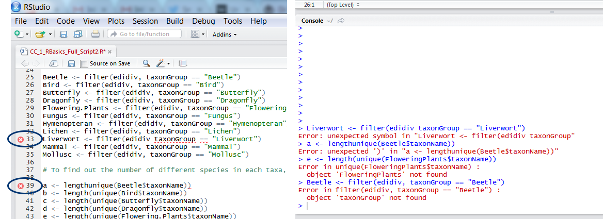

*Auteur : Valentin Mathieu - Dernière mise à jour 02 Septembre 2024*

***

# Dépannage et comment trouver de l'aide - Comment éviter les erreurs courantes dans l'analyse de données avec R

<!-- :240903:gf:r:enseignement: -->

La programmation s'accompagne d'une courbe d'apprentissage et vous rencontrerez sans doute de nombreux messages d'erreur lorsque vous vous familiariserez avec le fonctionnement de R. 
Mais n'ayez crainte ! Aujourd'hui, nous allons aborder certaines des erreurs de codage les plus courantes et vous aider à les éviter. 
Vous avez peut-être déjà vu certains de ces messages d'erreur, mais après avoir suivi ce tutoriel, on peut espérer qu'ils n'apparaîtront plus trop souvent sur vos écrans RStudio.

## Apprendre à détecter les erreurs dans R

Outre l'enregistrement de votre code, les scripts sont également utiles pour détecter les erreurs de codage simples avant même que vous n'exécutiez le code. 
Si RStudio détecte un caractère manquant, une commande qui n'a pas de sens en raison de fautes d'orthographe ou autres, un petit x rouge apparaît à côté de la ligne de code. 
C'est toujours une bonne idée de rechercher les x dans votre code avant de l'exécuter et c'est très pratique car vous savez exactement sur quelle ligne vous avez fait une erreur. 
L'autre façon dont R signale les erreurs est par le biais de messages dans la console, qui apparaissent après l'exécution d'un code qui n'est pas tout à fait correct. 
Bien que les messages d'erreur aient l'air effrayants (la police rouge et des mots comme « fatal » leur donnent une mauvaise réputation), ils constituent en fait la deuxième meilleure option par rapport à l'absence totale d'erreurs : R a identifié un problème et, à partir du message, vous pouvez comprendre de quoi il s'agit et le résoudre !

## Se familiariser avec les erreurs courantes et les solutions

Voici une liste des erreurs que souvent comises.

- **Votre version de R ou de RStudio est trop ancienne (ou trop récente)**. 
Si vous n'avez pas mis à jour R ou RStudio depuis un certain temps, il se peut que vous ne puissiez pas utiliser certains des nouveaux packages qui sortent - lorsque vous essayez d'installer le package, vous obtenez un message d'erreur disant que le package n'est pas compatible avec votre version de RStudio. 
Ce problème est rapidement résolu par une visite sur le site web de [RStudio](https://www.rstudio.com/products/rstudio/) ou sur le [site web de R](https://cran.r-project.org/), où vous pouvez obtenir la version la plus récente. 
En revanche, lorsque vous obtenez la version la plus récente de RStudio, les packages qui n'ont pas été mis à jour récemment peuvent ne pas fonctionner, ou votre ancien code peut se casser. 
Cela se produit moins souvent et, en général, le code évolue constamment et s'améliore de plus en plus, il est donc bon de se tenir au courant des dernières versions à la fois de RStudio et des packages R.

- **Erreurs de syntaxe**. Les erreurs les plus faciles à commettre ! 
Vous avez oublié une virgule, ouvert une parenthèse sans la fermer, ajouté un caractère supplémentaire par erreur ou quelque chose d'autre que R ne comprend pas. 
Ces erreurs sont généralement détectées par R et vous recevrez des messages d'erreur vous rappelant de relire votre code et de le corriger. 
Si vous n'arrivez pas à trouver la bonne façon de coder ce dont vous avez besoin, il existe de nombreux endroits où vous pouvez [trouver de l'aide](https://ourcodingclub.github.io/tutorials/troubleshooting/#help).
Le respect d'[une étiquette de codage](R-good-practices.md) peut vous aider à réduire ces erreurs au minimum.

- **Vous essayez d'utiliser une certaine fonction et R ne la reconnaît pas**. Tout d'abord, il convient de vérifier si vous avez installé et chargé le package d'où provient la fonction. 
L'exécution du code `?nom-fonction`, par exemple `?filter`, affichera un écran d'aide contenant des informations sur l'utilisation de la fonction, ainsi que sur le package d'où elle provient.
Si vous avez chargé plusieurs packages similaires dans votre bibliothèque, ils peuvent contenir différentes fonctions portant le même nom et votre code peut s'interrompre si R ne sait pas laquelle utiliser - l'exécution de `package::function`, par exemple `dplyr::filter` renverra des informations sur la fonction dans la console. Notez que R essaiera d'ajouter `()` à la fin de `dplyr::filter`. Supprimez-les et exécutez le code.
Si vous vous documentez sur R en ligne, ou si vous copiez et modifiez du code, il se peut que vous utilisiez une fonction d'un nouveau package sans le savoir. 
Si elle ne vous semble pas familière, la recherche de son nom sur Google avec « r package » peut révéler son origine. 
Parfois, les packages dépendent d'autres packages pour fonctionner. 
Souvent, ceux-ci sont installés automatiquement lorsque vous installez le package, mais il arrive que vous receviez un message d'erreur vous demandant d'installer un autre package, ce qui est facilement résolu par `install.packages("newpackage")`.

- **Breakdown et debugging des fonctions**. Si vous exécutez des fonctions que vous avez créées vous-même ou des boucles for, il se peut que vous deviez utiliser le navigateur de debugging de R. 
Vous trouverez de l'aide sur la page d'aide au [debugging de RStudio](https://support.rstudio.com/hc/en-us/articles/205612627-Debugging-with-RStudio). 

- **Objets manquants**. L'exécution de tests et le traçage de données sont souvent entravés par le fait que R ne parvient pas à trouver l'objet qu'il est censé analyser. 
Lorsque cela se produit, vérifiez d'abord que les noms de vos objets sont corrects : les fautes d'orthographe (lettres majuscules et minuscules, lettres erronées, etc.) peuvent rendre les objets méconnaissables. 
Dans ce code `e <- length(unique(FloweringPlants$taxonName))`, j'ai demandé à R de calculer la richesse en espèces des plantes à fleurs, mais j'ai oublié que j'appelais l'objet `Flowering.Plants` et non `FloweringPlants`. 
N'oubliez pas que lorsque vous faites référence à une certaine variable à partir d'un objet en utilisant le signe du dollar, l'objet vient en premier, la variable en second : `Flowering.Plants$taxonGroup`, et non `taxonGroup$Flowering.Plants`.

- **Les données ne sont pas dans le bon format**. Cela n'entraîne pas nécessairement un message d'erreur, mais peut conduire à des graphiques/résultats erronés. 
Si vos résultats/tracés vous semblent suspects, il est bon de revenir à vos données et de les vérifier : ont-elles été importées correctement dans R, et sont-elles dans le bon format ? 
Vous pouvez le faire en utilisant `head()` pour un aperçu, `str()` pour vérifier la classe de chaque variable, et `summary()`.

- **Mauvaise distribution des données utilisée dans les modèles**. Il existe plusieurs raisons pour lesquelles les modèles ne convergent pas, notamment l'utilisation d'un type de distribution inapproprié. 
En général, on choisit entre les distributions normale (gaussienne), binomiale, de Poisson ou de Quasipoisson, sur lesquelles on pourra revenir dans d'autres tutoriels. Mais cela dépasse le cadre de ce cours.

- **R a planté !** Si vous avez surchargé R, il peut quitter le système de manière spectaculaire (image de la bombe et tout le reste) ou parfois il ne répond plus et vous devez mettre fin à la session. 
C'est pourquoi il est très important de sauvegarder souvent vos scripts, mais il est préférable de les sauvegarder en tant que nouveaux fichiers, par exemple `Edi_biodiv_16thNov.R`, plutôt que d'écraser le même fichier. 
Ainsi, si vous souhaitez revenir à l'ancien code ou en utiliser une partie, vous le retrouverez facilement. 
Il s'agit du type de contrôle de version le plus élémentaire. Nous pouvons en apprendre plus sur le contrôle de version dans notre [tutoriel](https://ourcodingclub.github.io/tutorials/git) `git`.

- **Aaaah ! J'ai agrandi mon plot, et maintenant elle est en plein écran et je ne peux pas revenir en arrière !** Si vous cliquez sur la petite loupe dans la fenêtre `Plot`, votre plot s'ouvre dans une nouvelle fenêtre que vous pouvez redimensionner. 
C'est très pratique ! Ce qui est moins pratique, c'est lorsque vous faites accidentellement glisser la fenêtre en haut de votre écran et qu'elle s'affiche en plein écran, bloquant tout le reste. 
Ce n'est plus un problème avec les nouvelles versions de R Studio, mais si cela se produit, vous pouvez vous échapper en utilisant la touche *backspace* arrière de votre clavier - et avec un peu de chance, vous ne perdrez pas de données dans l'opération.

- **Je suis coincé dans une boucle de plus !** Si les nombres de parenthèses ouvrantes et fermantes ne correspondent pas, R pense qu'il y a plus de code à venir. 
C'est pourquoi, dans la console, il vous invite à ajouter du code : chaque fois que vous appuyez sur la touche Entrée, un nouveau `+` apparaît. 
Appuyez sur la touche `Echap` de votre clavier pour revenir à l'invite normale `>` dans la console et vérifiez votre code pour trouver votre erreur.

- **Le curseur dans le fichier script est passé de `|` à `_` et maintenant le texte est écrasé lorsque je le tape**. Cela se produit lorsque vous appuyez accidentellement sur la touche `Insert` de votre clavier et que, par conséquent, lorsque vous ajoutez du texte, celui-ci est écrasé. Appuyez à nouveau sur `Insert` pour revenir à la normale.

> Aide-mémoire !
>
> Voici quelques-uns des messages d'erreur les plus courants que vous rencontrerez lorsque vous commencerez à travailler, et ce qu'ils signifient :
>
> - **Error in function-name(...) : could not find function 'function-name'** : Cela signifie probablement que vous essayez d'utiliser une fonction d'un package que vous n'avez pas chargé. Tapez `??nom-fonction` (ou recherchez-le en ligne) pour savoir de quel package il provient, et assurez-vous que le package est chargé à l'aide de `library(nom-package)`. Ce qui nous amène à...
>
> - **Error in library(package-name) : there is no package called ‘package-name’** : Avez-vous installé le package ? Les packages doivent être installés une fois, en utilisant `install.packages('nom-du-paquet')`, après quoi ils peuvent être chargés avec la commande `library()`.
>
> - **Error in function-name(): object ‘object-name’ not found** : R vous indique qu'il ne peut pas trouver un objet qui devrait se trouver dans votre environnement. Tout d'abord, assurez-vous que vous avez un objet portant ce nom dans votre panneau `Environnement`. Il peut s'agir d'une simple erreur de frappe, par exemple si vous avez défini l'objet comme `birds_nests` et que vous essayez de le tracer en l'appelant `Bird_nests`. (Et oui, R est également sensible à la casse !) Il se peut également que vous n'ayez pas encore exécuté le code qui crée cet objet !
>
> - **Error: unexpected symbol in ‘line-of-code’** : Il est très probable que vous ayez oublié, ou que vous ayez eu en trop, une virgule, une parenthèse ou un autre signe de ponctuation quelque part.
>
> - **Cannot open file ‘your-file-path’: No such file or directory** : R ne trouve pas le fichier que vous essayez de charger, souvent parce que vous avez oublié de spécifier votre répertoire de travail, ou parce qu'il y a une erreur dans le chemin d'accès au fichier. (Astuce : si vous l'avez copié à partir de l'explorateur Windows, vous devez remplacer les barres obliques arrière par des barres obliques avant). Si vous obtenez l'objet « votre-chemin-de-fichier » introuvable, vous avez probablement oublié les guillemets autour du chemin de fichier `read.csv(file = 'mon-chemin-de-fichier/fichier.csv')`.

## Apprendre à trouver de l'aide

**Une recherche en ligne du message d'erreur (avec « R » et le nom de la fonction ou du package) est toujours un bon début**. Il y a de fortes chances que quelqu'un ait déjà rencontré cette erreur et ait posé des questions en ligne à ce sujet. Si le message d'erreur est très long, essayez de le paraphraser en vous basant sur ce que vous pensez être le problème (et supprimez les références à vos objets et noms de fichiers spécifiques). Il existe plusieurs forums et sites web très utiles où les gens demandent et reçoivent de l'aide, tels que [Stackoverflow](http://stackoverflow.com/) et [Rbloggers](https://www.r-bloggers.com/).

Pour les requêtes de type « comment ... », une recherche aboutira souvent à des tutoriels, et même à des vidéos sur Youtube. Par exemple, « ggplot how to change axis titles “ ou ” dplyr filtering on two conditions » vous permettront d'obtenir rapidement ce dont vous avez besoin.

R help Bien entendu, R dispose d'une documentation intégrée pour toutes les fonctions et tous les packages. Nous avons déjà mentionné que vous pouvez taper `help()` ou `?nom de la fonction` (essayez `??nom de la fonction` pour une recherche plus large). Le [site web RDocumentation](https://www.rdocumentation.org/) contient la même chose dans un format légèrement plus agréable, avec des exemples et plus de liens.

Aller également voir le tutoriel connexe [R-useful-links](R-useful-links.md) basé sur la brillante [compilation de ressources du coding club](https://ourcodingclub.github.io/links.html).

Bien sûr, R ne vous dira pas toujours si vous faites quelque chose de mal : parfois, votre code est correct, mais vous effectuez le mauvais type d'analyse pour vos données. Néanmoins, s'assurer que vous évitez les erreurs faciles à commettre est un excellent point de départ - même les tests les plus sophistiqués et les plus avancés peuvent être détruits par une simple virgule manquante.

> Un avertissement sur les avertissements !
> 
> Les erreurs ne sont pas le seul texte rouge effrayant qui apparaîtra dans la console. Il arrive souvent que vous exécutiez un code et que vous obteniez un message du type « Il y a eu 13 avertissements, utilisez warnings()pour les voir ». Il peut également s'agir d'un avertissement spécifique vous indiquant que R ignore les données NAs (manquantes) dans un graphique, ou qu'une fonction a généré des résultats inattendus tels que NaN (not a number).
> 
> Les avertissements ne sont pas nécessairement la fin du monde, mais vous devez les considérer comme des signaux d'alarme majeurs et vous assurer que vous savez ce qui se passe avant de poursuivre votre analyse. Comme pour les messages d'erreur, une simple recherche en ligne du texte de l'avertissement vous mettra souvent sur la bonne voie.

## R Cheatsheets

Vous pouvez accéder aux Cheatsheets de R directement sur RStudio en suivant `Help/Cheat Sheets` ou sur ce [site web qui en fait la compilation](https://posit.co/resources/cheatsheets/).

Elles sont des compagnons de code précieux qui vous rendent plus efficaces et limitent les erreurs.

***